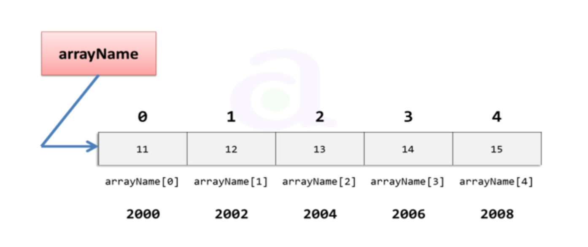

# Definition

Array is a contiguous area of memory either on the stack or on the heap, broken down into equal sized elements, and each of those elements is indexed by contigous integer.

A basic data structure which one uses in a day to day programming is an array. An array can hold a fixed number of containers to store data and operations could be performed on that data according to the user’s needs.

In the picture above, an array is defined with the name arrayName and has an integer data type. The number below in the bold shows the memory address each container of an array is assigned to. The important thing here to remember is an array index always starts at 0 and ends at (total array size -1). So, let’s just say you defined an array of length 5, arrayName[5], then the indexes of this array would be arrayName[0], arrayName[1], arrayName[2], arrayName[3], arrayName[4].

Simplest arrays are fixed size (immutable), which that we can't add or remove elements.

It can be zero based indexed or one based indexed.

Constant-time acces to read and constant-time access to write O(1).

Every element needs to be the same size, so we can do pointer arithmetic and have O(1) to read and write.
If each element had a diferent size, we would need to go through each one and sum all together. This would represent a O(n) time.

To read get the memory address of an element in the array, given an index that we are interest in named `i`, and `first_index` as a 0 or 1 (depending if it is zero based array or not):

`array_address + element_size x (i - first_index)`

# Times for common operations

|           |   Add   |   Remove  |
|-----------|---------|-----------|
| Beginning |   O(n)  |    O(n)   |
| End*       |   O(1) / O(n)  |    O(1)/O(n)   |
| Middle    |   O(n)  |    O(n)   |

If we need to add or remove an element from the beginning or middle of an array, we would need to shift each element, so that is done in linear time, order N operation, because we need to pass through each element in the worst case scenario.

If we need to remove or add at the end, that is done in constant-time, order 1 operation, altough, sometimes we may need to create a new array, which may run in linear time.

# Space

Arrays are contiguous in memory, so proximity helps performance. Space needed = (array capacity, which is >= n) * size of item, but even if we have 2n, we still get O(n).

# Resources:

[Coursera](https://www.coursera.org)

[Introduction to data structures](https://medium.com/swlh/introduction-to-data-structures-9134b7d064a6)