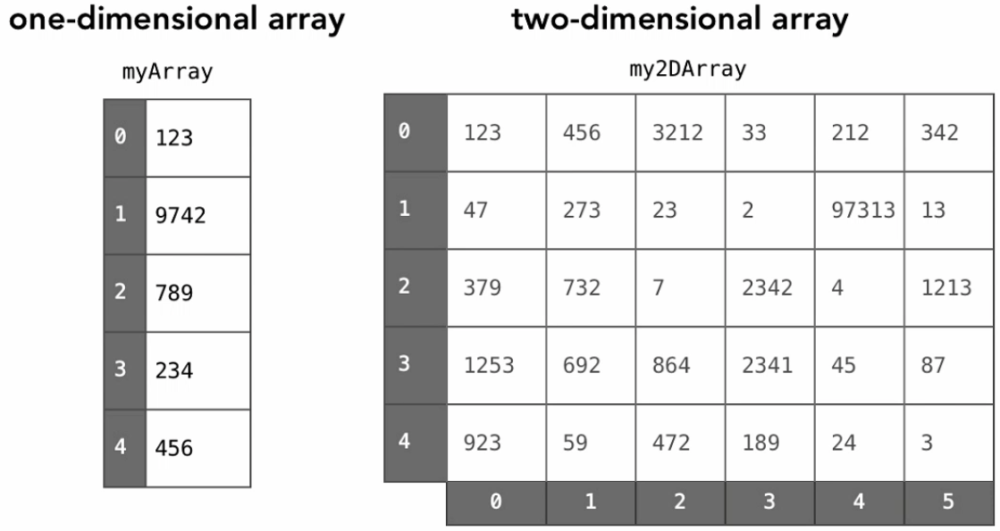

# Multi-dimensional arrays

Multi-dimensional arrays are arrays of arrays. Like a grid, a matrix or a table. Like a rectangular of n-dimensional arrays.

How do we find the address of an element? There are a couple of alternatives.

## Row major

If the elements are stored by row (let's say that we have the first row elements, then the second row elements, etc.), we would need to:

* First, we need to skip the full rows that we are not interested in.
* Then, we need to skip the elements in the same row.

Like this:

`array_address + element_size x ((row - 1 x elements_per_row) + i - first_index)`.

(1, 1)
(1, 2)
(1, 3)
(1, 4)
(1, 5)
(1, 6)
(2, 1)
(2, 2)
...

## Column major

If the elements are stored by column (let's say that we have the first column elements, then the second column elements, etc.), we would need to:

* First, we need to skip the full columns that we are not interested in.
* Then, we need to skip the elements in the same column.

Like this:

`array_address + element_size x ((column - 1 x elements_per_column) + i - first_index)`.

(1, 1)
(2, 1)
(3, 1)
(1, 2)
(2, 2)
(3, 2)
(1, 3)
(2, 3)
...

# Resources:

[Coursera](https://www.coursera.org)

[Introduction to data structures](https://medium.com/swlh/introduction-to-data-structures-9134b7d064a6)