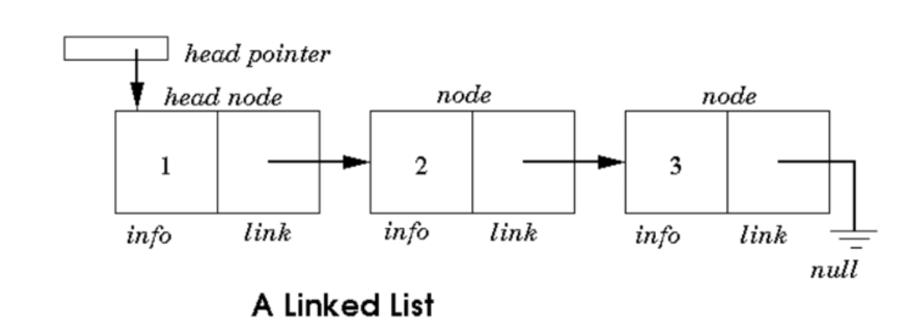

# Linked Lists

Linked lists, it's named kind of like links in a chain, right, so we've got a head pointer that points to a node that then has some data and points to another node, points to another node and eventually points to one that doesn't point any farther.

A linked list is a collection of nodes that are connected by links. Linked list contains node which store the data items and the address to the next node. The first node is usually referred to as the head node and the last node is referred to as the tail node. The pointer of the head node points to the next node and the pointer of the tail node points to Null.

The dynamics of this data structure makes it easier to add or remove nodes from the end. In order to add/remove a node, you just need to keep track of the previous node and the node after and adjust the pointers accordingly.

# Operations

## PushFront

1 - Create a node  
2 - Update our next pointer of that node to point to the head  
3 - Update the head pointer to point to our new node  
Allocate, update one pointer, update another pointer, constant time. It's O(1).  

| PushFront(key)                             |
|-----------------------------------------|
| `node <- new node`                 |
| `node.key <- key` |
| `node.next <- head`                          |
| `head <- node`                          |
| `if tail = nil:`                          |
| &nbsp;&nbsp;`tail <- head`                          |

## TopFront

1 - Look at the first element and return it.  
So TopFront is O(1). 

## PopFront

1 - Update the head pointer  
2 - Remove the node.  
So PopFront is going to be O(1). 

| PopFront()                             |
|-----------------------------------------|
| `if head = nil:`                 |
| &nbsp;&nbsp;`ERROR: empty list` |
| `head <- head.next`                          |
| `if head = nil:`                          |
| &nbsp;&nbsp;`tail <- nil`                          |

 

## PushBack

If we want to push at the back, and we don't have a tail pointer, then it's going to be a fairly expensive operation.  
1 - Start at the head and walk our way down the list until we get to the end  
2 - Add a node there.  
So that's going to be O(n) time.  

| PushBack(key)                             |
|-----------------------------------------|
| `node <- new node`                 |
| `node.key <- key` |
| `node.next <- nil`                          |
| `head <- node`                          |
| `if tail = nil:`                          |
| &nbsp;&nbsp;`head <- tail <- node`                          |
| `else:`                          |
| &nbsp;&nbsp;`tail.next <- node`                          |
| &nbsp;&nbsp;`tail <- node`                          |

## TopBack

1 - Start at the head and walk our way down the list until we get to the end  
2 - Return node.  
That's going to be O(n) time.  

## PopBack

1 - Start at the head and walk our way down the list until we get to the end minus one  
2 - Update the current node pointer to null  
3 - Remove the last node  
That's going to be O(n) time.  

If we have an head pointer and a tail pointer, getting the first element is cheap and getting the last element is cheap.

But PopBack is still O(n) because tail pointer does not point to the previous node, only the last one, in a singy linked list.

| PopFront()                             |
|-----------------------------------------|
| `if head = nil:`                 |
| &nbsp;&nbsp;`ERROR: empty list` |
| `if head = tail:`                          |
| &nbsp;&nbsp;`head <- tail <- nil`                          |
| `else:`                          |
| &nbsp;&nbsp;`p <- head`                          |
| &nbsp;&nbsp;`while p.next.next != nil:`                          |
| &nbsp;&nbsp;&nbsp;&nbsp;`p <- p.next`                          |
| &nbsp;&nbsp;`p.next <- nil;` |
| &nbsp;&nbsp;`tail <- p;` |

## Add After

| AddAfter(node, key) |
|---------------------|
| `node2 <- new node` |
| `node2.key <- key` |
| `node2.next = node.next` |
| `node.next =  node2` |
| `if tail = node:` |
| &nbsp;&nbsp;`tail <- node2` |

## Order of common operations

# Resources:

[Coursera](https://www.coursera.org)

[Introduction to data structures](https://medium.com/swlh/introduction-to-data-structures-9134b7d064a6)