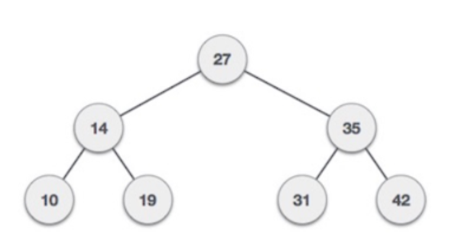

# Binary Trees

Binary trees are special kind of trees where the left node is always smaller than the parent node and the right node is always bigger than the parent node. In order to add/delete a node we have to compare the value with the root node and then traverse to a specific point to insert/delete.

# TODO
duplicates? on the right side of the tree. (in order traversal, elements will be sorted)
