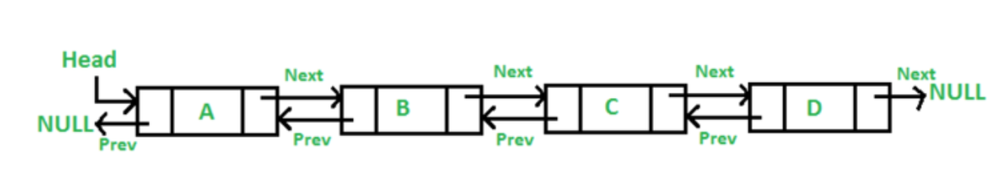
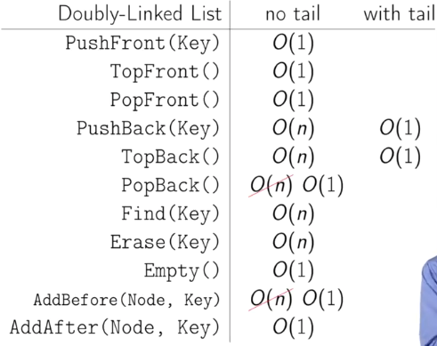

# Doubly-Linked List

A doubly linked list is not much different from a singly linked list, the only thing that sets them apart is the pointer to the previous node. The picture below can give you a brief idea of what the structure should look like.



In the case of a doubly linked list, the previous pointer of the head node points to Null and the next pointer of the tail points to Null. The previous pointer makes it easier to traverse in either direction. So, node addition and removal become super easy, all you need to do is keep track of the previous node and the next node and adjust the pointer accordingly.

Bi-directional pointers, to the next node and previous node.

The Linked-List contains a key, next pointer a previous pointer to go forward or go backwards.

PopBack is now order 1, constant-time.

## PushBack(key)

```
node <- new node
node.key <- key
node.next <- nil
if tail = nil
    head <- tail <- node
    node.prev = nil
else:
    tail.next = node
    node.prev = tail
    tail = node
```

## PopBack()

```
if head = nil:
    ERROR: emtpy list
if head = tail:
    head <- tail <- nil
else:
    tail <- tail.prev
    tail.next <- nil
```

## AddAfter(node, key)

```
node2 <- new node
node2.key <- key
node2.next <- node
node2.prev <- node.prev
node.prev <- node2
if node2.prev != nil:
    node2.prev.next <- node2
if head = node:
    head <- node2
```

## Operations Time



Reference: [Coursera](https://www.coursera.org/learn/data-structures/lecture/kHhgK/singly-linked-lists)

# Resources:

[Coursera](https://www.coursera.org)

[Introduction to data structures](https://medium.com/swlh/introduction-to-data-structures-9134b7d064a6)