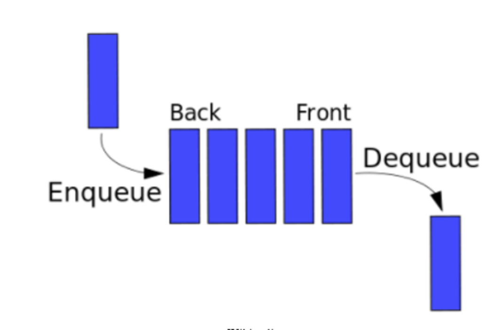

# Queue

## Summary

Just like the word stack, the word queue is also derived from day to day activities. You have most likely seen a queue of people in a supermarket at the billing counter where the last one to come stands at the end and the first one to come is the first one to get their groceries check out. In the similar manner, queue works where the operations are performed at both ends.

A stack is a FIFO data structure which elaborates to First In First Out. A queue, like stack, can either be implemented using arrays or linked list. The three most commonly performed operations on queue are:

· Key Enqueue(Key) — to input data into stack and place them at the bottom.

· Key Dequeue() — to remove the data from the top.

· Key Peek() — to look at the data at the top without removing it.

· Boolean isEmpty(): are there any elements?

## Definition

In computer science, a queue is a particular kind of abstract data type or collection in which the entities in the collection are kept in order and the principal (or only) operations on the collection are the addition of entities to the rear terminal position, known as enqueue, and removal of entities from the front terminal position, known as dequeue. This makes the queue a First-In-First-Out (FIFO) data structure. In a FIFO data structure, the first element added to the queue will be the first one to be removed. This is equivalent to the requirement that once a new element is added, all elements that were added before have to be removed before the new element can be removed. Often a peek or front operation is also entered, returning the value of the front element without dequeuing it. A queue is an example of a linear data structure, or more abstractly a sequential collection.

Queues provide services in computer science, transport, and operations research where various entities such as data, objects, persons, or events are stored and held to be processed later. In these contexts, the queue performs the function of a buffer.

Queues are common in computer programs, where they are implemented as data structures coupled with access routines, as an abstract data structure or in object-oriented languages as classes. Common implementations are circular buffers and linked lists.

## Implementation

Theoretically, one characteristic of a queue is that it does not have a specific capacity. Regardless of how many elements are already contained, a new element can always be added. It can also be empty, at which point removing an element will be impossible until a new element has been added again.

Fixed length arrays are limited in capacity, but it is not true that items need to be copied towards the head of the queue. The simple trick of turning the array into a closed circle and letting the head and tail drift around endlessly in that circle makes it unnecessary to ever move items stored in the array. If n is the size of the array, then computing indices modulo n will turn the array into a circle. This is still the conceptually simplest way to construct a queue in a high level language, but it does admittedly slow things down a little, because the array indices must be compared to zero and the array size, which is comparable to the time taken to check whether an array index is out of bounds, which some languages do, but this will certainly be the method of choice for a quick and dirty implementation, or for any high level language that does not have pointer syntax. The array size must be declared ahead of time, but some implementations simply double the declared array size when overflow occurs. Most modern languages with objects or pointers can implement or come with libraries for dynamic lists. Such data structures may have not specified fixed capacity limit besides memory constraints. Queue overflow results from trying to add an element onto a full queue and queue underflow happens when trying to remove an element from an empty queue.

A bounded queue is a queue limited to a fixed number of items.

There are several efficient implementations of FIFO queues. An efficient implementation is one that can perform the operations—enqueuing and dequeuing—in O(1) time.

- Linked list
    - A doubly linked list has O(1) insertion and deletion at both ends, so is a natural choice for queues.
    - A regular singly linked list only has efficient insertion and deletion at one end. However, a small modification—keeping a pointer to the last node in addition to the first one—will enable it to implement an efficient queue.
- A deque implemented using a modified dynamic array

# Support for Queue for different programming languages:

Java :- Queue can be implemented using List class in Java

C++ :- Like Java, C++ has also a Standard Template Library called Queue for queue implementation.

Python :- The queue module in python offers the functionality of the queue class. Since queues can be implemented using linked list therefore, llist can also be used.

# Resources:

[Coursera](https://www.coursera.org)

[Introduction to data structures](https://medium.com/swlh/introduction-to-data-structures-9134b7d064a6)