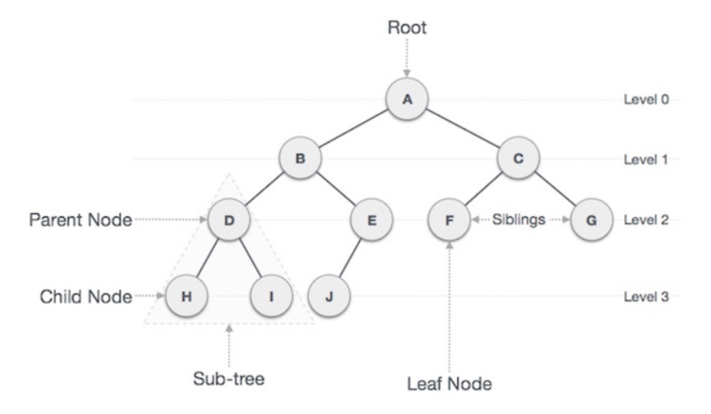

# Trees

The tree data structure resembles an upside tree, at the top we have a root node which is divided into a left and a right node. They have links between them, which connect all the nodes. Unlike linked list where a node can be connected to only one node, a tree could have a node connected to two or more nodes.

# Support for Trees for different programming languages

Java :- Java doesn’t have any built-in class to implement tree data structure.

C++ :- Just like Java, C++ also doesn’t have any container in standard template library to implement trees.

Python :- Python doesn’t have built-in data structures so in order to implement a tree you have to create the structure manually.

# Resources:

[Coursera](https://www.coursera.org)

[Introduction to data structures](https://medium.com/swlh/introduction-to-data-structures-9134b7d064a6)