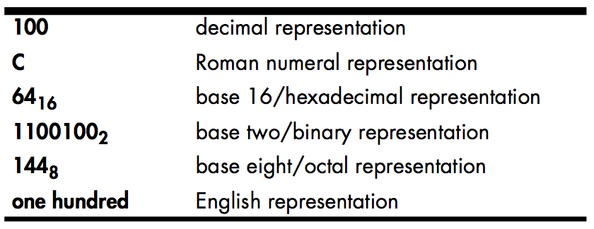
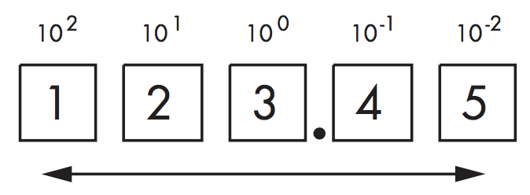
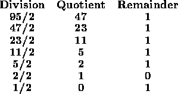

# Diference between number and the representation of that number

A number is an intangible, abstract, concept. It is an intellectual device that we use to denote quantity. Let’s say I were to tell you that “some book has one hundred pages.”

You could touch the pages — they are tangible. You could even count those pages to verify that there are one hundred of them. However, “one hundred” is simply an abstraction that I would be applying to the book as a way of describing its size.

The important thing to realize is that the following is not one hundred: 100. This is nothing more than ink on paper forming certain lines and curves.

You might recognize this sequence of symbols as a representation of one hundred, but this is not the actual value 100. It’s just three symbols appearing on this page. It isn’t even the only representation for one hundred. Consider the following table:

# The Decimal Positional Numbering System

The decimal positional notation (base 10) represents numbers using strings of Arabic numerals. In the decimal positional numbering system each digit appearing to the left of the decimal point represents a value between zero and nine times an increasing power of ten.

When you see a numeric sequence like “123.45,” you don’t think about the value 123.45; rather, you generate a mental image of this quantity. In reality, 123.45 represents:

1 × 102 + 2 × 101 + 3 × 100 + 4 × 10-1 + 5 × 10-2

or

100 + 20 + 3 + 0.4 + 0.05

Reference: [Write great code vol1](https://www.amazon.com/Write-Great-Code-Understanding-Machine/dp/1593270038)

# Radix

The decimal positional numbering system uses powers of ten and ten unique symbols for each digit position. Because decimal numbers use powers of ten, we call such numbers “base-10” numbers. By substituting a different set of numeric digits and multiplying those digits by powers of some base other than 10, we can devise a different numbering system to represent our numbers. The base, or radix, is the value that we raise to successive powers for each digit to the left of the radix point (note that the term decimal point only applies to decimal numbers).

As an example, we can create a base-8 numbering system using eight symbols (0–7) and powers of eight (base 8, or octal, was actually a common representation on early binary computer systems). The base-8 system uses successive powers of eight to represent values. Consider the octal number 1238 (the subscript denotes the base using standard mathematical notation), which is equivalent to 8310:

1 × 82 + 2 × 81 + 3 × 80

or

64 + 16 + 3

# The Binary Numbering System

The binary numbering system works just like the decimal numbering system, with two exceptions: binary only uses the digits 0 and 1 (rather than 0–9), and binary uses powers of two rather than powers of ten.

Most modern computer systems talk to I/O devices using binary, and their arith- metic circuitry operates on binary data.

## Converting Between Decimal and Binary Representation

To convert a binary value to decimal, we add `2i` for each "1" in the binary string, where `i` is the zero-based position of the binary digit. For example, the binary value `11001010` (base 2) represents:

`1 × 27 + 1 × 26 + 0 × 25 + 0 × 24 + 1 × 23 + 0 × 22 + 1× 21 + 0 × 20`

or

`128 + 64 + 8 + 2`

or

`202 (in decimal)`

Algorithm that converts decimal representation to the corresponding binary representation:

1. If the number is even, emit a zero. If the number is odd, emit a one.
2. Divide the number by two and throw away any fractional component or remainder.
3. If the quotient is zero, the algorithm is complete.
4. If the quotient is not zero and the number is odd, insert a one before the current string. If the quotient is not zero and the number is even, prefix your binary string with zero.
5. Go back to step 2 and repeat.

Consider the following example:

# The Hexadecimal Numbering System

Hexadecimal representation offers two great features: it’s very compact, and it’s easy to convert between binary and hexadecimal. Therefore, software engineers generally use hexadecimal representation rather than binary to make their programs more readable.

Because hexadecimal representation is base 16, each digit to the left of the hexadecimal point represents some value times a successive power of 16. For example, the number 1234 (base 16) is equal to:

`1 × 163 + 2 × 162 + 3 × 161 + 4 × 160`

or

`4096 + 512 + 48 + 4`

or

`4660 (base 10)`

Hexadecimal representation uses the letters A through F for the additional six digits it requires.

## Converting Between Hexadecimal and Binary Representations

| Binary | Hexadecimal |
|--------|-------------|
| %0000 | $0 |
| %0001 | $1 |
| %0010 | $2 |
| %0011 | $3 |
| %0100 | $4 |
| %0101 | $5 |
| %0110 | $6 |
| %0111 | $7 |
| %1000 | $8 |
| %1001 | $9 |
| %1010 | $A |
| %1011 | $B |
| %1100 | $C |
| %1101 | $D |
| %1110 | $E |
| %1111 | $F |

To convert the hexadecimal representation of a number into binary, sub- stitute the corresponding four binary bits for each hexadecimal digit. For example, to convert #ABCD into the binary form, use the table above:

`%1010_1011_1100_1101.`

To convert the binary representation of a number into hexadecimal is almost as easy. The first step is to pad the binary number with zeros to make sure it is a multiple of four bits long. For example, given the binary number 1011001010, the first step would be to add two zero bits to the left of the number so that it contains 12 bits without changing its value.

The next step is to separate the binary value into groups of four bits: 0010_1100_1010. Finally, look up these binary values in Table above and substitute the appropriate hexadecimal digits, which are #2CA.

## The Octal (Base-8) Numbering System

Octal (base-8) representation was common in early computer systems. As a result, you may still see people use the octal representation now and then. Octal is great for 12-bit and 36-bit computer systems (or any other size that is a multiple of three). However, it’s not particularly great for computer systems whose bit size is some power of two (8-bit, 16-bit, 32-bit, and 64-bit computer systems).