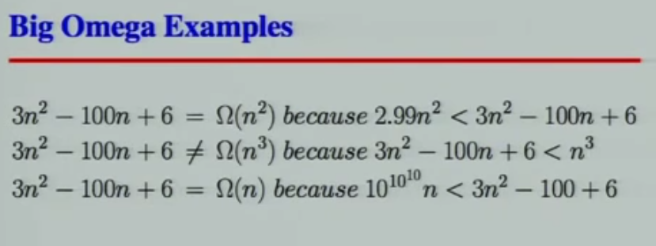

# Formal definition

A function T(N) is O(F(N)) if for some constant `c` and for values of `N` greater than some value `n0`:

`T(N) <= c * F(N)`

Suppose f(x) and g(x) are two functions defined on some subset of the real numbers. We write

`f(x) = O(g(x))`

or

`f(x) = O(g(x)) for x -> ∞`

Intuitively, this means that `f` does not grow faster than `g`.

# Names of Bounding Functions

Big O (O) is the upper bound of a function.

Big omega (Ω) is the lower bound of a function.

Big theta (Ɵ) is in the middle of Big O and Big Ω.

`g(n) = O(f(n))` means `C x f(n)` is an upper bound on `g(n)`.

`g(n) = Ω(f(n))` means `C x f(n)` is a lower bound on `g(n)`.

`g(n) = Ɵ(f(n))` means `C1 x f(n)` is an upper bound on `g(n)` and `C2 x f(n)` is a lower bound on `g(n)`. It's a tight bound.

`C, C1, C2` are all constants independent of `n`.

This definitions imply a contant `n0` beyond which they are satisfied. We do not care about small values of `n`.


# Orders

| notation      | name            |
|---------------|-----------------|
| O(1)          | constant        |
| O(log(n))     | logarithmic     |
| O((log(n))^c) | polylogarithmic |
| O(n)          | linear          |
| O(n^2)        | quadratic       |
| O(n^c)        | polynomial      |
| O(c^n)        | exponential     |

Note, too, that O(log n) is exactly the same as O(log(n^c)). The logarithms differ only by a
constant factor, and the big O notation ignores that. Similarly, logs with different constant
bases are equivalent.

Each memory access takes exactly 1 step. We measure the run time of an algorithm by counting the number of steps.

Be careful to differentiate between:

1. Performance: how much time/memory/disk/... is actually used when a program is run. This depends on the machine, compiler, etc. as well as the code.

2. Complexity: how do the resource requirements of a program or algorithm scale, i.e., what happens as the size of the problem being solved gets larger?


# Examples

## Big O


## Big Omega



## Big Theta


## Nested Loops

```bash
for I in 1 .. N loop
    for J in 1 .. M loop
        sequence of statements
    end loop;
end loop;
```

The outer loop executes N times. Every time the outer loop executes, the inner loop
executes M times. As a result, the statements in the inner loop execute a total of N * M
times. Thus, the complexity is O(N * M).

## Statements with function/ procedure calls

When a statement involves a function/ procedure call, the complexity of the statement
includes the complexity of the function/ procedure. Assume that you know that function/
procedure f takes constant time, and that function/procedure g takes time proportional to
(linear in) the value of its parameter k. Then the statements below have the time
complexities indicated.

```
f(k) has O(1)
g(k) has O(k)
```

When a loop is involved, the same rule applies. For example:

```
for J in 1 .. N loop
    g(J)
end loop;
```

has complexity of N^2. The loop executes N times and each function/procedure call g(N) is complexity O(N).

# Resources:

[MIT Big O PDF](http://web.mit.edu/16.070/www/lecture/big_o.pdf)

[CSE373 2012 - Lecture 02 - Big-O Notation (Asymptotic Notation)](https://www.youtube.com/watch?v=gSyDMtdPNpU&index=2&list=PLOtl7M3yp-DV69F32zdK7YJcNXpTunF2b)