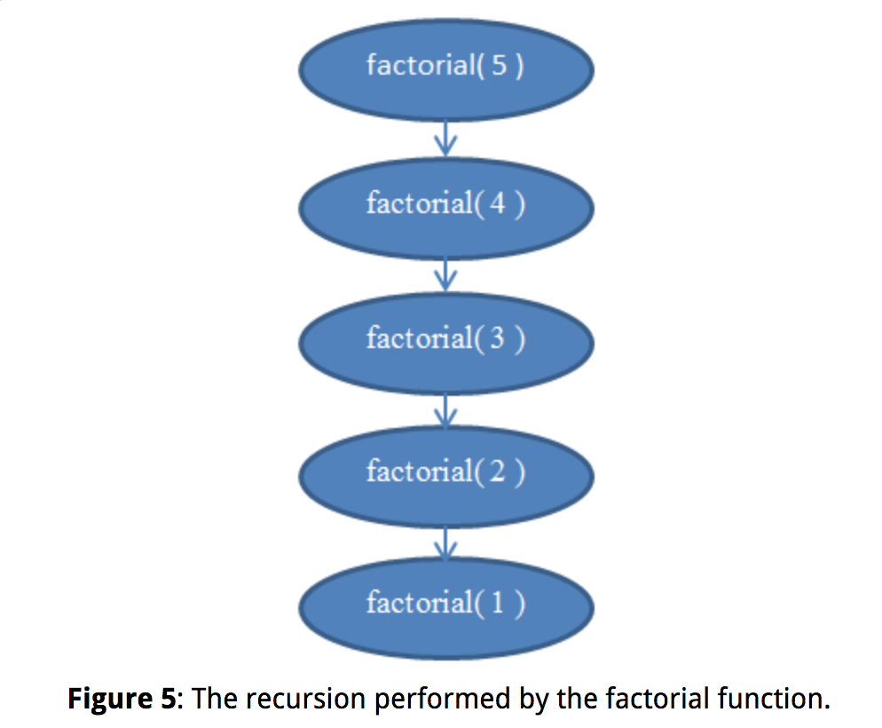
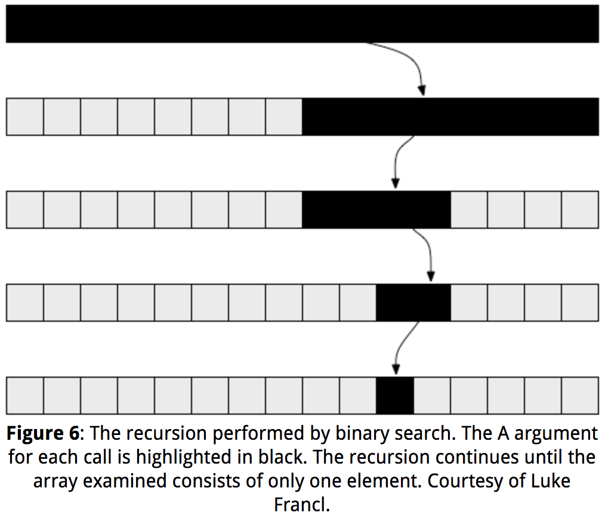
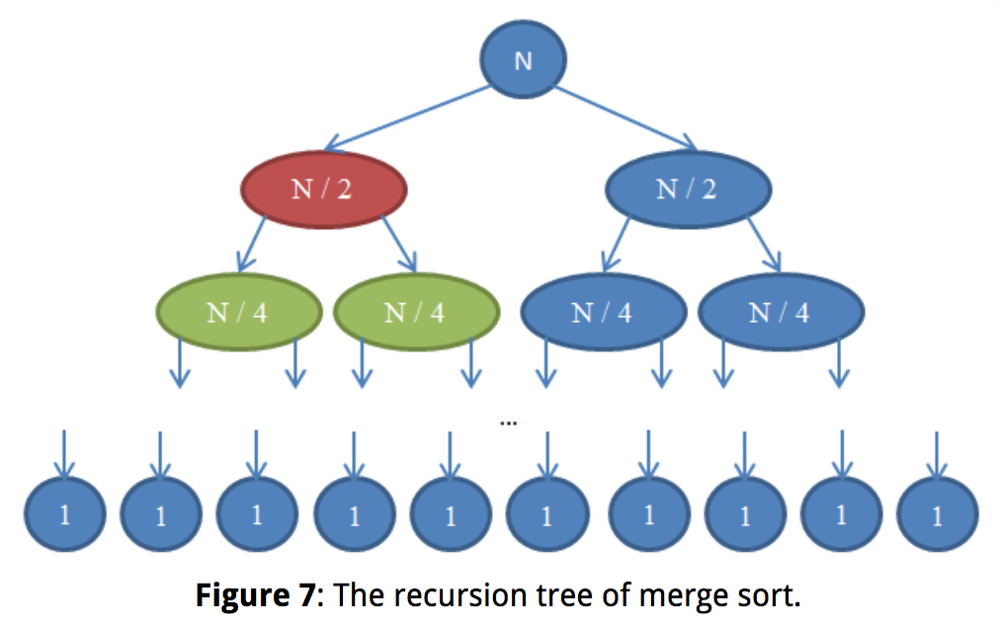
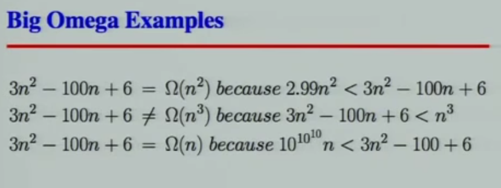

# Introduction

Algorithm complexity is just a way to formally measure how fast a program or algorithm runs.

We want to compare algorithms in terms of just what they are: Ideas of how something is computed. Counting milliseconds won't help us in that. It's quite possible that a bad algorithm written in a low-level programming language such as assembly runs much quicker than a good algorithm written in a high-level programming language such as Python or Ruby.

## Complexity analysis

Complexity analysis is also a tool that allows us to explain how an algorithm behaves as the input grows larger. If we feed it a different input, how will the algorithm behave? If our algorithm takes 1 second to run for an input of size 1000, how will it behave if I double the input size? Will it run just as fast, half as fast, or four times slower?

## Worst-case analysis

When analyzing algorithms, we often consider the worst-case scenario - worst-case analysis. In complexity analysis we only care about what happens to the instruction-counting function as the program input (n) grows large. This really goes along with the previous ideas of "worst-case scenario" behavior: We're interested in how our algorithm behaves when treated badly; when it's challenged to do something hard. Notice that this is really useful when comparing algorithms. If an algorithm beats another algorithm for a large input, it's most probably true that the faster algorithm remains faster when given an easier, smaller input. From the terms that we are considering, we'll drop all the terms that grow slowly and only keep the ones that grow fast as n becomes larger.

It makes some sense to drop multiplicative constant, such as in `6N`, we drop the constant `6`. If we think about how different programming languages compile. The "array lookup" statement in one language may compile to different instructions in different programming languages. For example, in C, doing A[ i ] does not include a check that i is within the declared array size, while in Pascal it does.

## Asymptotic behavior

This filter of "dropping all factors" and of "keeping the largest growing term" as described above is what we call asymptotic behavior. So the asymptotic behavior of f( n ) = 2n + 8 is described by the function f( n ) = n. Mathematically speaking, what we're saying here is that we're interested in the limit of function f as n tends to infinity. (On a side note, in a strict mathematical setting, we would not be able to drop the constants in the limit; but for computer science purposes, we want to do that for the reasons described above.)

Let us find the asymptotic behavior of the following example functions by dropping the constant factors and by keeping the terms that grow the fastest.

`f(n) = 5n + 12 gives f(n) = n.`

By using the exact same reasoning as above.

`f(n) = 109 gives f(n) = 1.`

We're dropping the multiplier 109 * 1, but we still have to put a 1 here to indicate that this function has a non-zero value.

`f(n) = n2 + 3n + 112 gives f(n) = n2`

Here, n2 grows larger than 3n for sufficiently large n, so we're keeping that.

`f(n) = n3 + 1999n + 1337 gives f(n) = n3`

Even though the factor in front of n is quite large, we can still find a large enough n so that n3 is bigger than 1999n. As we're interested in the behavior for very large values of n, we only keep n3.

`f(n) = n + sqrt(n) gives f(n) = n`

This is so because n grows faster than sqrt( n ) as we increase n.

## Complexity

Since we can drop all these decorative constants, it's pretty easy to tell the asymptotic behavior of the instruction-counting function of a program. In fact, any program that doesn't have any loops will have f( n ) = 1, since the number of instructions it needs is just a constant (unless it uses recursion;). Any program with a single loop which goes from 1 to n will have f( n ) = n, since it will do a constant number of instructions before the loop, a constant number of instructions after the loop, and a constant number of instructions within the loop which all run n times.

The following PHP program checks to see if a particular value exists within an array A of size n:

```php
<?php
    $exists = false;
    for ( $i = 0; $i < n; ++$i ) {
        if ( $A[ $i ] == $value ) {
            $exists = true;
            break;
        }
    }
?>
```

This method of searching for a value within an array is called linear search. This is a reasonable name, as this program has f( n ) = n. You may notice that there's a "break" statement here that may make the program terminate sooner, even after a single iteration. But recall that we're interested in the worst-case scenario, which for this program is for the array A to not contain the value. So we still have f( n ) = n.

Let's look at a Python program which adds two array elements together to produce a sum which it stores in another variable:

```python
v = a[ 0 ] + a[ 1 ]
```

Here we have a constant number of instructions, so we have f( n ) = 1.

The following program in C++ checks to see if a vector (a fancy array) named A of size n contains the same two values anywhere within it:

```c++
bool duplicate = false;
for ( int i = 0; i < n; ++i ) {
    for ( int j = 0; j < n; ++j ) {
        if ( i != j && A[ i ] == A[ j ] ) {
            duplicate = true;
            break;
        }
    }
    if ( duplicate ) {
        break;
    }
}
```

As here we have two nested loops within each other, we'll have an asymptotic behavior described by f( n ) = n2.

> Simple programs can be analyzed by counting the nested loops of the program. A single loop over n items yields f( n ) = n. A loop within a loop yields f( n ) = n2. A loop within a loop within a loop yields f( n ) = n3.

If we have a program that calls a function within a loop and we know the number of instructions the called function performs, it's easy to determine the number of instructions of the whole program. Indeed, let's take a look at this C example:

```c
int i;
for ( i = 0; i < n; ++i ) {
    f( n );
}
```

If we know that f( n ) is a function that performs exactly n instructions, we can then know that the number of instructions of the whole program is asymptotically n2, as the function is called exactly n times.

> Given a series of for loops that are sequential, the slowest of them determines the asymptotic behavior of the program. Two nested loops followed by a single loop is asymptotically the same as the nested loops alone, because the nested loops dominate the simple loop.

### Theta

When we've figured out the exact such f asymptotically, we'll say that our program is Θ( f( n ) ). For example, the above programs are Θ( 1 ), Θ( n2 ) and Θ( n2 ) respectively. Θ( n ) is pronounced "theta of n". Sometimes we say that f( n ), the original function counting the instructions including the constants, is Θ( something ). For example, we may say that f( n ) = 2n is a function that is Θ( n ) — nothing new here. We can also write 2n ∈ Θ( n ), which is pronounced as "two n is theta of n". Don't get confused about this notation: All it's saying is that if we've counted the number of instructions a program needs and those are 2n, then the asymptotic behavior of our algorithm is described by n, which we found by dropping the constants. Given this notation, the following are some true mathematical statements:

```
n6 + 3n ∈ Θ( n6 )
2n + 12 ∈ Θ( 2n )
3n + 2n ∈ Θ( 3n )
nn + n ∈ Θ( nn )
```

### Time complexity

We call this function, i.e. what we put within Θ( here ), the time complexity or just complexity of our algorithm. So an algorithm with Θ( n ) is of complexity n. We also have special names for Θ( 1 ), Θ( n ), Θ( n2 ) and Θ( log( n ) ) because they occur very often. We say that a Θ( 1 ) algorithm is a constant-time algorithm, Θ( n ) is linear, Θ( n2 ) is quadratic and Θ( log( n ) ) is logarithmic.

>  Programs with a bigger Θ run slower than programs with a smaller Θ.


# Big-O notation

We will be able to say that the behavior of our algorithm will never exceed a certain bound. This will make life easier for us, as we won't have to specify exactly how fast our algorithm runs, even when ignoring constants the way we did before. All we'll have to do is find a certain bound.

A famous problem computer scientists use for teaching algorithms is the sorting problem. In the sorting problem, an array A of size n is given and we are asked to write a program that sorts this array.

Here is an inefficient way to implement sorting an array in Ruby.

```ruby
b = []
n.times do
    m = a[ 0 ]
    mi = 0
    a.each_with_index do |element, i|
        if element < m
            m = element
            mi = i
        end
    end
    a.delete_at( mi )
    b << m
end
```

This method is called selection sort. It finds the minimum of our array (the array is denoted a above, while the minimum value is denoted m and mi is its index), puts it at the end of a new array (in our case b), and removes it from the original array. Then it finds the minimum between the remaining values of our original array, appends that to our new array so that it now contains two elements, and removes it from our original array. It continues this process until all items have been removed from the original and have been inserted into the new array, which means that the array has been sorted. In this example, we can see that we have two nested loops. The outer loop runs n times, and the inner loop runs once for each element of the array a. While the array a initially has n items, we remove one array item in each iteration. So the inner loop repeats n times during the first iteration of the outer loop, then n - 1 times, then n - 2 times and so forth, until the last iteration of the outer loop during which it only runs once.

## Upper bound - O

It's a little harder to evaluate the complexity of this program, as we'd have to figure out the sum 1 + 2 + ... + (n - 1) + n. But we can for sure find an "upper bound" for it. That is, we can alter our program (you can do that in your mind, not in the actual code) to make it worse than it is and then find the complexity of that new program that we derived. If we can find the complexity of the worse program that we've constructed, then we know that our original program is at most that bad, or maybe better. That way, if we find out a pretty good complexity for our altered program, which is worse than our original, we can know that our original program will have a pretty good complexity too – either as good as our altered program or even better.

Let's now think of the way to edit this example program to make it easier to figure out its complexity. But let's keep in mind that we can only make it worse, i.e. make it take up more instructions, so that our estimate is meaningful for our original program. Clearly we can alter the inner loop of the program to always repeat exactly n times instead of a varying number of times. Some of these repetitions will be useless, but it will help us analyze the complexity of the resulting algorithm. If we make this simple change, then the new algorithm that we've constructed is clearly Θ( n2 ), because we have two nested loops where each repeats exactly n times. If that is so, we say that the original algorithm is O( n2 ). O( n2 ) is pronounced "big oh of n squared". What this says is that our program is asymptotically no worse than n2. It may even be better than that, or it may be the same as that. By the way, if our program is indeed Θ( n2 ), we can still say that it's O( n2 ). To help you realize that, imagine altering the original program in a way that doesn't change it much, but still makes it a little worse, such as adding a meaningless instruction at the beginning of the program. Doing this will alter the instruction-counting function by a simple constant, which is ignored when it comes to asymptotic behavior. So a program that is Θ( n2 ) is also O( n2 ).

But a program that is O( n2 ) may not be Θ( n2 ). For example, any program that is Θ( n ) is also O( n2 ) in addition to being O( n ). If we imagine the that a Θ( n ) program is a simple for loop that repeats n times, we can make it worse by wrapping it in another for loop which repeats n times as well, thus producing a program with f( n ) = n2. To generalize this, any program that is Θ( a ) is O( b ) when b is worse than a. Notice that our alteration to the program doesn't need to give us a program that is actually meaningful or equivalent to our original program. It only needs to perform more instructions than the original for a given n. All we're using it for is counting instructions, not actually solving our problem.

So, saying that our program is O( n2 ) is being on the safe side: We've analyzed our algorithm, and we've found that it's never worse than n2. But it could be that it's in fact n2. This gives us a good estimate of how fast our program runs. Let's go through a few examples to help you familiarize yourself with this new notation.

```
A Θ( n ) algorithm is O( n )
We know that this is true as our original program was Θ( n ). We can achieve O( n ) without altering our program at all.

A Θ( n ) algorithm is O( n2 )
As n2 is worse than n, this is true.

A Θ( n2 ) algorithm is O( n3 )
As n3 is worse than n2, this is true.

A Θ( n ) algorithm is O( 1 )
As 1 is not worse than n, this is false. If a program takes n instructions asymptotically (a linear number of instructions), we can't make it worse and have it take only 1 instruction asymptotically (a constant number of instructions).

A O( 1 ) algorithm is Θ( 1 )
This is true as the two complexities are the same.

A O( n ) algorithm is Θ( 1 )
This may or may not be true depending on the algorithm. In the general case it's false. If an algorithm is Θ( 1 ), then it certainly is O( n ). But if it's O( n ) then it may not be Θ( 1 ). For example, a Θ( n ) algorithm is O( n ) but not Θ( 1 ).
```

## Tight bound - Θ

Because the O-complexity of an algorithm gives an upper bound for the actual complexity of an algorithm, while Θ gives the actual complexity of an algorithm, we sometimes say that the Θ gives us a tight bound. If we know that we've found a complexity bound that is not tight, we can also use a lower-case o to denote that. For example, if an algorithm is Θ( n ), then its tight complexity is n. Then this algorithm is both O( n ) and O( n2 ). As the algorithm is Θ( n ), the O( n ) bound is a tight one. But the O( n2 ) bound is not tight, and so we can write that the algorithm is o( n2 ), which is pronounced "small o of n squared" to illustrate that we know our bound is not tight. It's better if we can find tight bounds for our algorithms, as these give us more information about how our algorithm behaves, but it's not always easy to do.

```
A Θ( n ) algorithm for which we found a O( n ) upper bound.
In this case, the Θ complexity and the O complexity are the same, so the bound is tight.

A Θ( n2 ) algorithm for which we found a O( n3 ) upper bound.
Here we see that the O complexity is of a larger scale than the Θ complexity so this bound is not tight. Indeed, a bound of O( n2 ) would be a tight one. So we can write that the algorithm is o( n3 ).

A Θ( 1 ) algorithm for which we found an O( n ) upper bound.
Again we see that the O complexity is of a larger scale than the Θ complexity so we have a bound that isn't tight. A bound of O( 1 ) would be a tight one. So we can point out that the O( n ) bound is not tight by writing it as o( n ).

A Θ( n ) algorithm for which we found an O( 1 ) upper bound.
We must have made a mistake in calculating this bound, as it's wrong. It's impossible for a Θ( n ) algorithm to have an upper bound of O( 1 ), as n is a larger complexity than 1. Remember that O gives an upper bound.

A Θ( n ) algorithm for which we found an O( 2n ) upper bound.
This may seem like a bound that is not tight, but this is not actually true. This bound is in fact tight. Recall that the asymptotic behavior of 2n and n are the same, and that O and Θ are only concerned with asymptotic behavior. So we have that O( 2n ) = O( n ) and therefore this bound is tight as the complexity is the same as the Θ.
```

> It's easier to figure out the O-complexity of an algorithm than its Θ-complexity.

## Lower Bound - Ω / ω

Let's introduce just two more symbols before we move on to a few examples. These are easy now that you know Θ, O and o, and we won't use them much later in this article, but it's good to know them now that we're at it. In the example above, we modified our program to make it worse (i.e. taking more instructions and therefore more time) and created the O notation. O is meaningful because it tells us that our program will never be slower than a specific bound, and so it provides valuable information so that we can argue that our program is good enough. If we do the opposite and modify our program to make it better and find out the complexity of the resulting program, we use the notation Ω. Ω therefore gives us a complexity that we know our program won't be better than. This is useful if we want to prove that a program runs slowly or an algorithm is a bad one. This can be useful to argue that an algorithm is too slow to use in a particular case. For example, saying that an algorithm is Ω( n3 ) means that the algorithm isn't better than n3. It might be Θ( n3 ), as bad as Θ( n4 ) or even worse, but we know it's at least somewhat bad. So Ω gives us a lower bound for the complexity of our algorithm. Similarly to ο, we can write ω if we know that our bound isn't tight. For example, a Θ( n3 ) algorithm is ο( n4 ) and ω( n2 ). Ω( n ) is pronounced "big omega of n", while ω( n ) is pronounced "small omega of n".

For the following Θ complexities write down a tight and a non-tight O bound, and a tight and non-tight Ω bound of your choice, providing they exist.

```
Θ( 1 ) - The tight bounds will be O( 1 ) and Ω( 1 ). A non-tight O-bound would be O( n ). Recall that O gives us an upper bound. As n is of larger scale than 1 this is a non-tight bound and we can write it as o( n ) as well. But we cannot find a non-tight bound for Ω, as we can't get lower than 1 for these functions. So we'll have to do with the tight bound.

Θ( sqrt( n ) ) - The tight bounds will have to be the same as the Θ complexity, so they are O( sqrt( n ) ) and Ω( sqrt( n ) ) respectively. For non-tight bounds we can have O( n ), as n is larger than sqrt( n ) and so it is an upper bound for sqrt( n ). As we know this is a non-tight upper bound, we can also write it as o( n ). For a lower bound that is not tight, we can simply use Ω( 1 ). As we know that this bound is not tight, we can also write it as ω( 1 ).

Θ( n ) - The tight bounds are O( n ) and Ω( n ). Two non-tight bounds could be ω( 1 ) and o( n3 ). These are in fact pretty bad bounds, as they are far from the original complexities, but they are still valid using our definitions.

Θ( n2 ) - The tight bounds are O( n2 ) and Ω( n2 ). For non-tight bounds we could again use ω( 1 ) and o( n3 ) as in our previous example.

Θ( n3 ) - The tight bounds are O( n3 ) and Ω( n3 ) respectively. Two non-tight bounds could be ω( sqrt( n ) n2 ) and o( sqrt( n ) n3 ). Although these bounds are not tight, they're better than the ones we gave above.
```

The reason we use O and Ω instead of Θ even though O and Ω can also give tight bounds is that we may not be able to tell if a bound we've found is tight, or we may just not want to go through the process of scrutinizing it so much.


Asymptotic comparison operator  | Numeric comparison operator
--------------------------------|-----------------------------
Our algorithm is o( something ) | A number is < something
Our algorithm is O( something )	| A number is ≤ something
Our algorithm is Θ( something )	| A number is = something
Our algorithm is Ω( something )	| A number is ≥ something
Our algorithm is ω( something )	| A number is > something

While all the symbols O, o, Ω, ω and Θ are useful at times, O is the one used more commonly, as it's easier to determine than Θ and more practically useful than Ω.


# Logarithms

A logarithm is an operation applied to a number that makes it quite smaller – much like a square root of a number. So if there's one thing you want to remember about logarithms is that they take a number and make it much smaller than the original. Now, in the same way that square roots are the inverse operation of squaring something, logarithms are the inverse operation of exponentiating something.

```2^x = 1024```

We now wish to solve this equation for x. So we ask ourselves: What is the number to which we must raise the base 2 so that we get 1024? That number is 10. Indeed, we have 2^10 = 1024, which is easy to verify. Logarithms help us denote this problem using new notation. In this case, 10 is the logarithm of 1024 and we write this as log( 1024 ) and we read it as "the logarithm of 1024". Because we're using 2 as a base, these logarithms are called base 2 logarithms. There are logarithms in other bases.


Solve the equations below. Denote what logarithm you're finding in each case. Use only logarithms base 2.

```
2^x = 64
By trial and error we can find that x = 6 and so log( 64 ) = 6.

(2^2)^x = 64
Here we notice that (22)x, by the properties of exponents, can be written as 22x. So we have that 2x = 6 because log( 64 ) = 6 from the previous result and therefore x = 3.

4^x = 4
Using our knowledge from the previous equation, we can write 4 as 22 and so our equation becomes (22)x = 4 which is the same as 22x = 4. Then we notice that log( 4 ) = 2 because 22 = 4 and therefore we have that 2x = 2. So x = 1. This is readily observed from the original equation, as using an exponent of 1 yields the base as a result.

2^x = 1
Recall that an exponent of 0 yields a result of 1. So we have log( 1 ) = 0 as 20 = 1, and so x = 0.

2^x + 2^x = 32
Here we have a sum and so we can't take the logarithm directly. However we notice that 2x + 2x is the same as 2 * (2x). So we've multiplied in yet another two, and therefore this is the same as 2x + 1 and now all we have to do is solve the equation 2x + 1 = 32. We find that log( 32 ) = 5 and so x + 1 = 5 and therefore x = 4.

(2^x) * (2^x) = 64
We're multiplying together two powers of 2, and so we can join them by noticing that (2x) * (2x) is the same as 22x. Then all we need to do is to solve the equation 22x = 64 which we already solved above and so x = 3.
```

For competition algorithms implemented in C++, once you've analyzed your complexity, you can get a rough estimate of how fast your program will run by expecting it to perform about 1,000,000 operations per second, where the operations you count are given by the asymptotic behavior function describing your algorithm. For example, a Θ( n ) algorithm takes about a second to process the input for n = 1,000,000.

# Recursive complexity

A recursive function is a function that calls itself. Can we analyze its complexity? The following function, written in Python, evaluates the factorial of a given number. The factorial of a positive integer number is found by multiplying it with all the previous positive integers together. For example, the factorial of 5 is 5 * 4 * 3 * 2 * 1. We denote that "5!" and pronounce it "five factorial".

```python
def factorial( n ):
    if n == 1:
        return 1
    return n * factorial( n - 1 )
```

This function doesn't have any loops in it, but its complexity isn't constant either. What we need to do to find out its complexity is again to go about counting instructions. Clearly, if we pass some n to this function, it will execute itself n times. If you're unsure about that, run it "by hand" now for n = 5 to validate that it actually works. For example, for n = 5, it will execute 5 times, as it will keep decreasing n by 1 in each call. We can see therefore that this function is then Θ( n ).



If you're unsure about this fact, remember that you can always find the exact complexity by counting instructions. If you wish, you can now try to count the actual instructions performed by this function to find a function f( n ) and see that it's indeed linear (recall that linear means Θ( n )).

# Logarithmic complexity

One famous problem in computer science is that of searching for a value within an array. We solved this problem earlier for the general case. This problem becomes interesting if we have an array which is sorted and we want to find a given value within it. One method to do that is called binary search. We look at the middle element of our array: If we find it there, we're done. Otherwise, if the value we find there is bigger than the value we're looking for, we know that our element will be on the left part of the array. Otherwise, we know it'll be on the right part of the array. We can keep cutting these smaller arrays in halves until we have a single element to look at. Here's the method using pseudocode:

```python
def binarySearch( A, n, value ):
    if n = 1:
        if A[ 0 ] = value:
            return true
        else:
            return false
    if value < A[ n / 2 ]:
        return binarySearch( A[ 0...( n / 2 - 1 ) ], n / 2 - 1, value )
    else if value > A[ n / 2 ]:
        return binarySearch( A[ ( n / 2 + 1 )...n ], n / 2 - 1, value )
    else:
        return true
```



This pseudocode is a simplification of the actual implementation. In practice, this method is easier described than implemented, as the programmer needs to take care of some implementation issues. There are off-by-one errors and the division by 2 may not always produce an integer value and so it's necessary to floor() or ceil() the value. But we can assume for our purposes that it will always succeed, and we'll assume our actual implementation in fact takes care of the off-by-one errors, as we only want to analyze the complexity of this method.

Let us now attempt to analyze this algorithm. Again, we have a recursive algorithm in this case. Let's assume, for simplicity, that the array is always cut in exactly a half, ignoring just now the + 1 and - 1 part in the recursive call. By now you should be convinced that a little change such as ignoring + 1 and - 1 won't affect our complexity results. This is a fact that we would normally have to prove if we wanted to be prudent from a mathematical point of view, but practically it is intuitively obvious. Let's assume that our array has a size that is an exact power of 2, for simplicity. Again this assumption doesn't change the final results of our complexity that we will arrive at. The worst-case scenario for this problem would happen when the value we're looking for does not occur in our array at all. In that case, we'd start with an array of size n in the first call of the recursion, then get an array of size n / 2 in the next call. Then we'll get an array of size n / 4 in the next recursive call, followed by an array of size n / 8 and so forth. In general, our array is split in half in every call, until we reach 1. So, let's write the number of elements in our array for every call:

```
0th iteration: n
1st iteration: n / 2
2nd iteration: n / 4
3rd iteration: n / 8
...
ith iteration: n / 2^i
...
last iteration: 1
```

Notice that in the i-th iteration, our array has n / 2^i elements. This is because in every iteration we're cutting our array into half, meaning we're dividing its number of elements by two. This translates to multiplying the denominator with a 2. If we do that i times, we get n / 2^i. Now, this procedure continues and with every larger i we get a smaller number of elements until we reach the last iteration in which we have only 1 element left. If we wish to find i to see in what iteration this will take place, we have to solve the following equation:

`1 = n / 2^i`

This will only be true when we have reached the final call to the binarySearch() function, not in the general case. So solving for i here will help us find in which iteration the recursion will finish. Multiplying both sides by 2^i we get:

`2^i = n`

Now, this equation should look familiar if you read the logarithms section above. Solving for i we have:

`i = log( n )`

This tells us that the number of iterations required to perform a binary search is log( n ) where n is the number of elements in the original array.

If you think about it, this makes some sense. For example, take n = 32, an array of 32 elements. How many times do we have to cut this in half to get only 1 element? We get: 32 → 16 → 8 → 4 → 2 → 1. We did this 5 times, which is the logarithm of 32. Therefore, the complexity of binary search is Θ( log( n ) ).

This last result allows us to compare binary search with linear search, our previous method. Clearly, as log( n ) is much smaller than n, it is reasonable to conclude that binary search is a much faster method to search within an array then linear search, so it may be advisable to keep our arrays sorted if we want to do many searches within them.

> Improving the asymptotic running time of a program often tremendously increases its performance, much more than any smaller "technical" optimizations such as using a faster programming language.

# Optimal sorting

We looked at a sorting implementation above called a selection sort. We mentioned that selection sort is not optimal. An optimal algorithm is an algorithm that solves a problem in the best possible way, meaning there are no better algorithms for this. This means that all other algorithms for solving the problem have a worse or equal complexity to that optimal algorithm. There may be many optimal algorithms for a problem that all share the same complexity. The sorting problem can be solved optimally in various ways. We can use the same idea as with binary search to sort quickly. This sorting method is called mergesort.

To perform a mergesort, we will first need to build a helper function that we will then use to do the actual sorting. We will make a merge function which takes two arrays that are both already sorted and merges them together into a big sorted array. This is easily done:

```python
def merge( A, B ):
    if empty( A ):
        return B
    if empty( B ):
        return A
    if A[ 0 ] < B[ 0 ]:
        return concat( A[ 0 ], merge( A[ 1...A_n ], B ) )
    else:
        return concat( B[ 0 ], merge( A, B[ 1...B_n ] ) )
```

The concat function takes an item, the "head", and an array, the "tail", and builds up and returns a new array which contains the given "head" item as the first thing in the new array and the given "tail" item as the rest of the elements in the array. For example, concat( 3, [ 4, 5, 6 ] ) returns [ 3, 4, 5, 6 ]. We use A_n and B_n to denote the sizes of arrays A and B respectively.

Analyzing this algorithm reveals that it has a running time of Θ( n ), where n is the length of the resulting array (n = A_n + B_n).

Utilizing this function we can build a better sorting algorithm. The idea is the following: We split the array into two parts. We sort each of the two parts recursively, then we merge the two sorted arrays into one big array. In pseudocode:

```python
def mergeSort( A, n ):
    if n = 1:
        return A # it is already sorted
    middle = floor( n / 2 )
    leftHalf = A[ 1...middle ]
    rightHalf = A[ ( middle + 1 )...n ]
    return merge( mergeSort( leftHalf, middle ), mergeSort( rightHalf, n - middle ) )
```

In every step of mergeSort, we're splitting the array into two halves of equal size, similarly to binarySearch. However, in this case, we maintain both halves throughout execution. We then apply the algorithm recursively in each half. After the recursion returns, we apply the merge operation on the result which takes Θ( n ) time.

So, we split the original array into two arrays of size n / 2 each. Then we merge those arrays, an operation that merges n elements and thus takes Θ( n ) time.



Let's see what's going on here. Each circle represents a call to the mergeSort function. The number written in the circle indicates the size of the array that is being sorted. The top blue circle is the original call to mergeSort, where we get to sort an array of size n. The arrows indicate recursive calls made between functions. The original call to mergeSort makes two calls to mergeSort on two arrays, each of size n / 2. This is indicated by the two arrows at the top. In turn, each of these calls makes two calls of its own to mergeSort two arrays of size n / 4 each, and so forth until we arrive at arrays of size 1. This diagram is called a recursion tree, because it illustrates how the recursion behaves and looks like a tree (the root is at the top and the leaves are at the bottom, so in reality it looks like an inversed tree).

Notice that at each row in the above diagram, the total number of elements is n. To see this, take a look at each row individually. The first row contains only one call to mergeSort with an array of size n, so the total number of elements is n. The second row has two calls to mergeSort each of size n / 2. But n / 2 + n / 2 = n and so again in this row the total number of elements is n. In the third row, we have 4 calls each of which is applied on an n / 4-sized array, yielding a total number of elements equal to n / 4 + n / 4 + n / 4 + n / 4 = 4n / 4 = n. So again we get n elements. Now notice that at each row in this diagram the caller will have to perform a merge operation on the elements returned by the callees. For example, the circle indicated with red color has to sort n / 2 elements. To do this, it splits the n / 2-sized array into two n / 4-sized arrays, calls mergeSort recursively to sort those (these calls are the circles indicated with green color), then merges them together. This merge operation requires to merge n / 2 elements. At each row in our tree, the total number of elements merged is n. In the row that we just explored, our function merges n / 2 elements and the function on its right (which is in blue color) also has to merge n / 2 elements of its own. That yields n elements in total that need to be merged for the row we're looking at.

By this argument, the complexity for each row is Θ( n ). We know that the number of rows in this diagram, also called the depth of the recursion tree, will be log( n ). The reasoning for this is exactly the same as the one we used when analyzing the complexity of binary search. We have log( n ) rows and each of them is Θ( n ), therefore the complexity of mergeSort is Θ( n * log( n ) ). This is much better than Θ( n2 ) which is what selection sort gave us (remember that log( n ) is much smaller than n, and so n * log( n ) is much smaller than n * n = n2).

As you saw in this last example, complexity analysis allows us to compare algorithms to see which one is better. Under these circumstances, we can now be pretty certain that merge sort will outperform selection sort for large arrays. This conclusion would be hard to draw if we didn't have the theoretical background of algorithm analysis that we developed. In practice, indeed sorting algorithms of running time Θ( n * log( n ) ) are used. For example, the [Linux kernel uses a sorting algorithm called heapsort](http://lxr.free-electrons.com/source/lib/sort.c), which has the same running time as mergesort which we explored here, namely Θ( n log( n ) ) and so is optimal. Notice that we have not proven that these sorting algorithms are optimal. Doing this requires a slightly more involved mathematical argument, but rest assured that they can't get any better from a complexity point of view.

# Formal definition

A function T(N) is O(F(N)) if for some constant `c` and for values of `N` greater than some value `n0`:

`T(N) <= c * F(N)`

Suppose f(x) and g(x) are two functions defined on some subset of the real numbers. We write

`f(x) = O(g(x))`

or

`f(x) = O(g(x)) for x -> ∞`

Intuitively, this means that `f` does not grow faster than `g`.

# Names of Bounding Functions

Big O (O) is the upper bound of a function.

Big omega (Ω) is the lower bound of a function.

Big theta (Ɵ) is in the middle of Big O and Big Ω.

`g(n) = O(f(n))` means `C x f(n)` is an upper bound on `g(n)`.

`g(n) = Ω(f(n))` means `C x f(n)` is a lower bound on `g(n)`.

`g(n) = Ɵ(f(n))` means `C1 x f(n)` is an upper bound on `g(n)` and `C2 x f(n)` is a lower bound on `g(n)`. It's a tight bound.

`C, C1, C2` are all constants independent of `n`.

This definitions imply a contant `n0` beyond which they are satisfied. We do not care about small values of `n`.


Each of these complexities defines a numerical function: time vs. size.

# Orders

| notation      | name            |
|---------------|-----------------|
| O(1)          | constant        |
| O(log(n))     | logarithmic     |
| O((log(n))^c) | polylogarithmic |
| O(n)          | linear          |
| O(n^2)        | quadratic       |
| O(n^c)        | polynomial      |
| O(c^n)        | exponential     |

Note, too, that O(log n) is exactly the same as O(log(n^c)). The logarithms differ only by a
constant factor, and the big O notation ignores that. Similarly, logs with different constant
bases are equivalent. But when both functions in a product are increasing, both constants are important.

Each memory access takes exactly 1 step. We measure the run time of an algorithm by counting the number of steps.

Be careful to differentiate between:

1. Performance: how much time/memory/disk/... is actually used when a program is run. This depends on the machine, compiler, etc. as well as the code.

2. Complexity: how do the resource requirements of a program or algorithm scale, i.e., what happens as the size of the problem being solved gets larger?


# Examples

## Big O


## Big Omega



## Big Theta


## Nested Loops

```bash
for I in 1 .. N loop
    for J in 1 .. M loop
        sequence of statements
    end loop;
end loop;
```

The outer loop executes N times. Every time the outer loop executes, the inner loop
executes M times. As a result, the statements in the inner loop execute a total of N * M
times. Thus, the complexity is O(N * M).

## Statements with function/procedure calls

When a statement involves a function/procedure call, the complexity of the statement
includes the complexity of the function/procedure. Assume that you know that function/
procedure f takes constant time, and that function/procedure g takes time proportional to
(linear in) the value of its parameter k. Then the statements below have the time
complexities indicated.

```
f(k) has O(1)
g(k) has O(k)
```

When a loop is involved, the same rule applies. For example:

```
for J in 1 .. N loop
    g(J)
end loop;
```

has complexity of N^2. The loop executes N times and each function/procedure call g(N) is complexity O(N).

Multiplication by a factor does not add anything.


# Resources:

[Dionysis "dionyziz" Zindros article about complexity analysis](http://discrete.gr/complexity/)

[MIT Big O PDF](http://web.mit.edu/16.070/www/lecture/big_o.pdf)

[CSE373 2012 - Lecture 02 - Big-O Notation (Asymptotic Notation)](https://www.youtube.com/watch?v=gSyDMtdPNpU&index=2&list=PLOtl7M3yp-DV69F32zdK7YJcNXpTunF2b)

[train logarithms](http://tutorial.math.lamar.edu/Classes/Alg/LogFunctions.aspx)

[Big o cheat sheet poster](https://github.com/ro31337/bigoposter/blob/master/bigoposter.pdf)