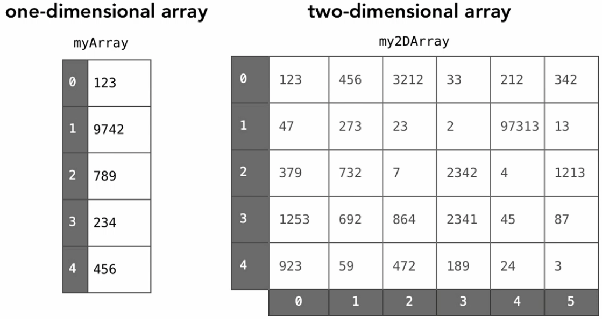

# Introduction

## Summary

Array is a contiguous area of memory either on the stack or on the heap, broken down into equal sized elements, and each of those elements is indexed by contigous integer.

A basic data structure which one uses in a day to day programming is an array. An array can hold a fixed number of containers to store data and operations could be performed on that data according to the user’s needs.

In the picture above, an array is defined with the name arrayName and has an integer data type. The number below in the bold shows the memory address each container of an array is assigned to. The important thing here to remember is an array index always starts at 0 and ends at (total array size -1). So, let’s just say you defined an array of length 5, arrayName[5], then the indexes of this array would be arrayName[0], arrayName[1], arrayName[2], arrayName[3], arrayName[4].

Simplest arrays are fixed size (immutable), which that we can't add or remove elements.

It can be zero based indexed or one based indexed.

Constant-time acces to read and constant-time access to write O(1).

Every element needs to be the same size, so we can do pointer arithmetic and have O(1) to read and write.
If each element had a diferent size, we would need to go through each one and sum all together. This would represent a O(n) time.

To read get the memory address of an element in the array, given an index that we are interest in named `i`, and `first_index` as a 0 or 1 (depending if it is zero based array or not):

`array_address + element_size x (i - first_index)`

## Definition

In computer science, an array data structure, or simply an array, is a data structure consisting of a collection of elements (values or variables), each identified by at least one array index or key. An array is stored such that the position of each element can be computed from its index tuple by a mathematical formula. The simplest type of data structure is a linear array, also called one-dimensional array.

For example, an array of 10 32-bit integer variables, with indices 0 through 9, may be stored as 10 words at memory addresses 2000, 2004, 2008, ... 2036, so that the element with index i has the address 2000 + 4 × i.

The memory address of the first element of an array is called first address or foundation address.

Because the mathematical concept of a matrix can be represented as a two-dimensional grid, two-dimensional arrays are also sometimes called matrices. In some cases the term "vector" is used in computing to refer to an array, although tuples rather than vectors are the more mathematically correct equivalent. Tables are often implemented in the form of arrays, especially lookup tables; the word table is sometimes used as a synonym of array.

Arrays are among the oldest and most important data structures, and are used by almost every program. They are also used to implement many other data structures, such as lists and strings. They effectively exploit the addressing logic of computers. In most modern computers and many external storage devices, the memory is a one-dimensional array of words, whose indices are their addresses. Processors, especially vector processors, are often optimized for array operations.

Arrays are useful mostly because the element indices can be computed at run time. Among other things, this feature allows a single iterative statement to process arbitrarily many elements of an array. For that reason, the elements of an array data structure are required to have the same size and should use the same data representation. The set of valid index tuples and the addresses of the elements (and hence the element addressing formula) are usually,[3][5] but not always,[2] fixed while the array is in use.

The term array is often used to mean array data type, a kind of data type provided by most high-level programming languages that consists of a collection of values or variables that can be selected by one or more indices computed at run-time. Array types are often implemented by array structures; however, in some languages they may be implemented by hash tables, linked lists, search trees, or other data structures.

The term is also used, especially in the description of algorithms, to mean associative array or "abstract array", a theoretical computer science model (an abstract data type or ADT) intended to capture the essential properties of arrays. Arrays have better cache locality as compared to linked lists.

## Applications

Arrays are used to implement mathematical vectors and matrices, as well as other kinds of rectangular tables. Many databases, small and large, consist of (or include) one-dimensional arrays whose elements are records.

Arrays are used to implement other data structures, such as lists, heaps, hash tables, deques, queues, stacks, strings, and VLists. Array-based implementations of other data structures are frequently simple and space-efficient (implicit data structures), requiring little space overhead, but may have poor space complexity, particularly when modified, compared to tree-based data structures (compare a sorted array to a search tree).

One or more large arrays are sometimes used to emulate in-program dynamic memory allocation, particularly memory pool allocation. Historically, this has sometimes been the only way to allocate "dynamic memory" portably.

Arrays can be used to determine partial or complete control flow in programs, as a compact alternative to (otherwise repetitive) multiple IF statements. They are known in this context as control tables and are used in conjunction with a purpose built interpreter whose control flow is altered according to values contained in the array. The array may contain subroutine pointers (or relative subroutine numbers that can be acted upon by SWITCH statements) that direct the path of the execution.

## Element identifier and addressing formulas

When data objects are stored in an array, individual objects are selected by an index that is usually a non-negative scalar integer. Indexes are also called subscripts. An index maps the array value to a stored object.

There are three ways in which the elements of an array can be indexed:

- 0 (zero-based indexing): The first element of the array is indexed by subscript of 0.[8]
- 1 (one-based indexing): The first element of the array is indexed by subscript of 1.[9]
- n (n-based indexing): The base index of an array can be freely chosen. Usually programming languages allowing n-based indexing also allow negative index values and other scalar data types like enumerations, or characters may be used as an array index.

Using zero based indexing is design choice of many influential programming languages, including C, Java and Lisp. This leads to simpler implementation where the subscript refers to an offset from the starting position of an array, so the first element has an offset of zero.

Arrays can have multiple dimensions, thus it is not uncommon to access an array using multiple indices. For example, a two-dimensional array A with three rows and four columns might provide access to the element at the 2nd row and 4th column by the expression A[1][3] in the case of a zero-based indexing system. Thus two indices are used for a two-dimensional array, three for a three-dimensional array, and n for an n-dimensional array.

The number of indices needed to specify an element is called the dimension, dimensionality, or rank of the array.

In standard arrays, each index is restricted to a certain range of consecutive integers (or consecutive values of some enumerated type), and the address of an element is computed by a "linear" formula on the indices.

## One-dimensional arrays

A one-dimensional array (or single dimension array) is a type of linear array. Accessing its elements involves a single subscript which can either represent a row or column index.

As an example consider the C declaration int anArrayName[10];

Syntax : datatype anArrayname[sizeofArray];

In the given example the array can contain 10 elements of any value available to the int type. In C, the array element indices are 0-9 inclusive in this case. For example, the expressions anArrayName[0] and anArrayName[9] are the first and last elements respectively.

For a vector with linear addressing, the element with index i is located at the address B + c × i, where B is a fixed base address and c a fixed constant, sometimes called the address increment or stride.

If the valid element indices begin at 0, the constant B is simply the address of the first element of the array. For this reason, the C programming language specifies that array indices always begin at 0; and many programmers will call that element "zeroth" rather than "first".

However, one can choose the index of the first element by an appropriate choice of the base address B. For example, if the array has five elements, indexed 1 through 5, and the base address B is replaced by B + 30c, then the indices of those same elements will be 31 to 35. If the numbering does not start at 0, the constant B may not be the address of any element.

## Multi-dimensional arrays

For a multidimensional array, the element with indices i,j would have address B + c · i + d · j, where the coefficients c and d are the row and column address increments, respectively.

More generally, in a k-dimensional array, the address of an element with indices i1, i2, ..., ik is

`B + c1 · i1 + c2 · i2 + ... + ck · ik.`

For example: int a[2][3];

This means that array a has 2 rows and 3 columns, and the array is of integer type. Here we can store 6 elements they are stored linearly but starting from first row linear then continuing with second row. The above array will be stored as a11, a12, a13, a21, a22, a23.

This formula requires only k multiplications and k additions, for any array that can fit in memory. Moreover, if any coefficient is a fixed power of 2, the multiplication can be replaced by bit shifting.

The coefficients ck must be chosen so that every valid index tuple maps to the address of a distinct element.

If the minimum legal value for every index is 0, then B is the address of the element whose indices are all zero. As in the one-dimensional case, the element indices may be changed by changing the base address B. Thus, if a two-dimensional array has rows and columns indexed from 1 to 10 and 1 to 20, respectively, then replacing B by B + c1 - − 3 c1 will cause them to be renumbered from 0 through 9 and 4 through 23, respectively. Taking advantage of this feature, some languages (like FORTRAN 77) specify that array indices begin at 1, as in mathematical tradition while other languages (like Fortran 90, Pascal and Algol) let the user choose the minimum value for each index.

Multi-dimensional arrays are arrays of arrays. Like a grid, a matrix or a table. Like a rectangular of n-dimensional arrays.

How do we find the address of an element? There are a couple of alternatives.

### Row major

If the elements are stored by row (let's say that we have the first row elements, then the second row elements, etc.), we would need to:

* First, we need to skip the full rows that we are not interested in.
* Then, we need to skip the elements in the same row.

Like this:

`array_address + element_size x ((row - 1 x elements_per_row) + i - first_index)`.

(1, 1)
(1, 2)
(1, 3)
(1, 4)
(1, 5)
(1, 6)
(2, 1)
(2, 2)
...

### Column major

If the elements are stored by column (let's say that we have the first column elements, then the second column elements, etc.), we would need to:

* First, we need to skip the full columns that we are not interested in.
* Then, we need to skip the elements in the same column.

Like this:

`array_address + element_size x ((column - 1 x elements_per_column) + i - first_index)`.

(1, 1)
(2, 1)
(3, 1)
(1, 2)
(2, 2)
(3, 2)
(1, 3)
(2, 3)
...

## Jagged arrays

Sometimes, we do not want to have a rectangular multidimensional array. Because we may want arrays width different sizes. If we have a multi dimensional array representing the days in each month, we would end up with arrays with 31, 30, 27 and elements.

Jagged arrays are arrays of arrays with different lengths. We often need programming logic to create this type of data structure.

## Resizable arrays

It's common in many languages that when a basic array is created it cannot be resized. What many languages to in the background is create a new array, with more memory, to fit in the new elements. This is an order N operation.

> The idea is to store a pointer to a dynamically allocated array, and replace it with a newly-allocated array as needed.

Dynamic array is an abstract data type with the following operations (at a minimum):

* Get(i): returns element at location `i` in constant-time O(1).
* Set(i, val): sets element `i` to `val` in constant-time O(1).
* PushBack(i):  adds `val` to the end of the array in linear time O(n).
* Remove(i): removes element at location `i` in linear time O(n).
* Size(): the number of elements in the array in constant-time O(1).

### Implementation

Store:

| variable  | description                               |
|-----------|-------------------------------------------|
| arr       | dynamically-allocated array               |
| capacity  | size of the dynamically-allocated array   |
| size      | number of elements currently in the array |

Example by duplicating the capacity:

Start with capacity of 2, and size 0.

PushBack(a) -> size: 1, capacity: 2.
PushBack(b) -> size: 2, capacity: 2.
PushBack(c) -> allocate a new dynamically allocated array with capacity 4 and size 3
PushBack(d) -> size: 4, capacity: 4
PushBack(e) -> allocate a new dynamically allocated array with capacity 8 and size 4

| Get(i)                                  |
|-----------------------------------------|
| `if i < 0 or i ≥ size:`                 |
| &nbsp;&nbsp;`Error: index out of range` |
| `return arr[i]`                         |

 

| Set(i, val)                             |
|-----------------------------------------|
| `if i < 0 or i ≥ size:`                 |
| &nbsp;&nbsp;`Error: index out of range` |
| `arr[i] = val`                          |

 

| PushBack(val)                           |
|-----------------------------------------|
| `if size = capacity:`                   |
| &nbsp;&nbsp;`allocate new_arr[2 x capacity]` |
| &nbsp;&nbsp;`for i from 0 to size - 1:` |
| &nbsp;&nbsp;&nbsp;&nbsp;`new_arr[i] <- arr[i]` |
| &nbsp;&nbsp;`free arr` |
| &nbsp;&nbsp;`arr <- new_arr; capacity <- 2 x capacity` |
| `arr[size] <- val` |
| `size <- size + 1` |

 

| Remove(i)                             |
|-----------------------------------------|
| `if i < 0 or i ≥ size:`                 |
| &nbsp;&nbsp;`Error: index out of range` |
| `for j from i to size - 2:` |
| &nbsp;&nbsp;`arr[j] <- arr[j + 1]` |
| `size <- size - 1` |

 

| Size()                             |
|-----------------------------------------|
| `return size`                 |

[Resizable Array Implementation](https://github.com/tiagoinacio/algorithms_cpp/blob/master/src/data-structures/array/array-list.h)

[Pointer Arithmetic Implementation](https://github.com/tiagoinacio/algorithms_cpp/blob/master/src/data-structures/array/array-list.h#L75)

### Summary:

Unlike static arrays, dynamic arrays **can be resized**.

**Appending** a new element to a dynamic array is often constant time, but **can take O(n)**.

Some space is wasted, at the most **half of the space is wasted**.

Resize can also be done to shrink the array.

## Efficiency

Both store and select take (deterministic worst case) constant time. Arrays take linear (O(n)) space in the number of elements n that they hold.

In an array with element size k and on a machine with a cache line size of B bytes, iterating through an array of n elements requires the minimum of ceiling(nk/B) cache misses, because its elements occupy contiguous memory locations. This is roughly a factor of B/k better than the number of cache misses needed to access n elements at random memory locations. As a consequence, sequential iteration over an array is noticeably faster in practice than iteration over many other data structures, a property called locality of reference (this does not mean however, that using a perfect hash or trivial hash within the same (local) array, will not be even faster - and achievable in constant time). Libraries provide low-level optimized facilities for copying ranges of memory (such as memcpy) which can be used to move contiguous blocks of array elements significantly faster than can be achieved through individual element access. The speedup of such optimized routines varies by array element size, architecture, and implementation.

Memory-wise, arrays are compact data structures with no per-element overhead. There may be a per-array overhead, e.g. to store index bounds, but this is language-dependent. It can also happen that elements stored in an array require less memory than the same elements stored in individual variables, because several array elements can be stored in a single word; such arrays are often called packed arrays. An extreme (but commonly used) case is the bit array, where every bit represents a single element. A single octet can thus hold up to 256 different combinations of up to 8 different conditions, in the most compact form.

Array accesses with statically predictable access patterns are a major source of data parallelism.

### Time for common operations

|           |   Add   |   Remove  |
|-----------|---------|-----------|
| Beginning |   O(n)  |    O(n)   |
| End*       |   O(1) / O(n)  |    O(1)/O(n)   |
| Middle    |   O(n)  |    O(n)   |

If we need to add or remove an element from the beginning or middle of an array, we would need to shift each element, so that is done in linear time, order N operation, because we need to pass through each element in the worst case scenario.

If we need to remove or add at the end, that is done in constant-time, order 1 operation, altough, sometimes we may need to create a new array, which may run in linear time.

### Space

Arrays are contiguous in memory, so proximity helps performance. Space needed = (array capacity, which is >= n) * size of item, but even if we have 2n, we still get O(n).

## Dimension

The dimension of an array is the number of indices needed to select an element. Thus, if the array is seen as a function on a set of possible index combinations, it is the dimension of the space of which its domain is a discrete subset. Thus a one-dimensional array is a list of data, a two-dimensional array a rectangle of data, a three-dimensional array a block of data, etc.

This should not be confused with the dimension of the set of all matrices with a given domain, that is, the number of elements in the array. For example, an array with 5 rows and 4 columns is two-dimensional, but such matrices form a 20-dimensional space. Similarly, a three-dimensional vector can be represented by a one-dimensional array of size three.

## Resources:

[Coursera](https://www.coursera.org)

[Introduction to data structures](https://medium.com/swlh/introduction-to-data-structures-9134b7d064a6)

[Wikipedia](https://en.wikipedia.org/wiki/Array_data_structure)
