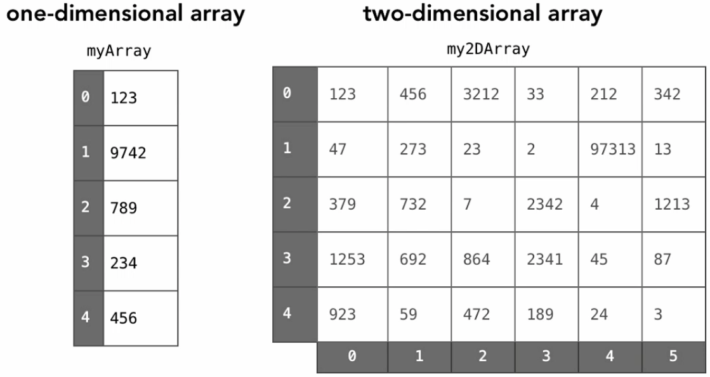
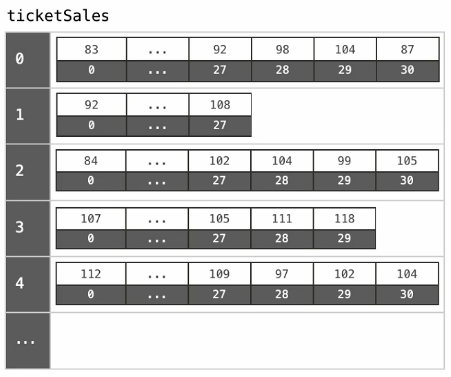

# Definition

Array is a contiguous area of memory either on the stack or on the heap, broken down into equal sized elements, and each of those elements is indexed by contigous integer.

Simplest arrays are fixed size (immutable), which that we can't add or remove elements.

It can be zero based indexed or one based indexed.

Constant-time acces to read and constant-time access to write O(1).

Every element needs to be the same size, so we can do pointer arithmetic and have O(1) to read and write.
If each element had a diferent size, we would need to go through each one and sum all together. This would represent a O(n) time.

To read get the memory address of an element in the array, given an index that we are interest in named `i`, and `first_index` as a 0 or 1 (depending if it is zero based array or not):

`array_address + element_size x (i - first_index)`

# Multi-dimensional arrays

Multi-dimensional arrays are arrays of arrays. Like a grid, a matrix or a table. Like a rectangular of n-dimensional arrays.

How do we find the address of an element? There are a couple of alternatives.

## Row major

If the elements are stored by row (let's say that we have the first row, then the second row, etc.), we would need to:

* First, we need to skip the full rows that we are not interested in.
* Then, we need to skip the elements in the same row.

Like this:

`array_address + element_size x ((row - 1 x elements_per_row) + i - first_index)`.

## Row major

If the elements are stored by row (let's say that we have the first row elements, then the second row elements, etc.), we would need to:

* First, we need to skip the full rows that we are not interested in.
* Then, we need to skip the elements in the same row.

Like this:

`array_address + element_size x ((row - 1 x elements_per_row) + i - first_index)`.

(1, 1)
(1, 2)
(1, 3)
(1, 4)
(1, 5)
(1, 6)
(2, 1)
(2, 2)
...

## Column major

If the elements are stored by column (let's say that we have the first column elements, then the second column elements, etc.), we would need to:

* First, we need to skip the full columns that we are not interested in.
* Then, we need to skip the elements in the same column.

Like this:

`array_address + element_size x ((column - 1 x elements_per_column) + i - first_index)`.

(1, 1)
(2, 1)
(3, 1)
(1, 2)
(2, 2)
(3, 2)
(1, 3)
(2, 3)
...

# Times for common operations

|           |   Add   |   Remove  |
|-----------|---------|-----------|
| Beginning |   O(n)  |    O(n)   |
| End*       |   O(1) / O(n)  |    O(1)/O(n)   |
| Middle    |   O(n)  |    O(n)   |

If we need to add or remove an element from the beginning or middle of an array, we would need to shift each element, so that is done in linear time, order N operation, because we need to pass through each element in the worst case scenario.

If we need to remove or add at the end, that is done in constant-time, order 1 operation, altough, sometimes we may need to create a new array, which may run in linear time.

# Jagged arrays

Sometimes, we do not want to have a rectangular multidimensional array. Because we may want arrays width different sizes. If we have a multi dimensional array representing the days in each month, we would end up with arrays with 31, 30, 27 and elements.

Jagged arrays are arrays of arrays with different lengths. We often need programming logic to create this type of data structure.

# Resizable arrays

It's common in many languages that when a basic array is created it cannot be resized. What many languages to in the background is create a new array, with more memory, to fit in the new elements. This is an order N operation.

> The idea is to store a pointer to a dynamically allocated array, and replace it with a newly-allocated array as needed.

Dynamic array is an abstract data type with the following operations (at a minimum):

* Get(i): returns element at location `i` in constant-time O(1).
* Set(i, val): sets element `i` to `val` in constant-time O(1).
* PushBack(i):  adds `val` to the end of the array in linear time O(n).
* Remove(i): removes element at location `i` in linear time O(n).
* Size(): the number of elements in the array in constant-time O(1).

## Implementation

Store:

| variable  | description                               |
|-----------|-------------------------------------------|
| arr       | dynamically-allocated array               |
| capacity  | size of the dynamically-allocated array   |
| size      | number of elements currently in the array |

Example by duplicating the capacity:

Start with capacity of 2, and size 0.

PushBack(a) -> size: 1, capacity: 2.
PushBack(b) -> size: 2, capacity: 2.
PushBack(c) -> allocate a new dynamically allocated array with capacity 4 and size 3
PushBack(d) -> size: 4, capacity: 4
PushBack(e) -> allocate a new dynamically allocated array with capacity 8 and size 4

| Get(i)                                  |
|-----------------------------------------|
| `if i < 0 or i ≥ size:`                 |
| &nbsp;&nbsp;`Error: index out of range` |
| `return arr[i]`                         |

 

| Set(i, val)                             |
|-----------------------------------------|
| `if i < 0 or i ≥ size:`                 |
| &nbsp;&nbsp;`Error: index out of range` |
| `arr[i] = val`                          |

 

| PushBack(val)                           |
|-----------------------------------------|
| `if size = capacity:`                   |
| &nbsp;&nbsp;`allocate new_arr[2 x capacity]` |
| &nbsp;&nbsp;`for i from 0 to size - 1:` |
| &nbsp;&nbsp;&nbsp;&nbsp;`new_arr[i] <- arr[i]` |
| &nbsp;&nbsp;`free arr` |
| &nbsp;&nbsp;`arr <- new_arr; capacity <- 2 x capacity` |
| `arr[size] <- val` |
| `size <- size + 1` |

 

| Remove(i)                             |
|-----------------------------------------|
| `if i < 0 or i ≥ size:`                 |
| &nbsp;&nbsp;`Error: index out of range` |
| `for j from i to size - 2:` |
| &nbsp;&nbsp;`arr[j] <- arr[j + 1]` |
| `size <- size - 1` |

 

| Size()                             |
|-----------------------------------------|
| `return size`                 |

## Summary:

Unlike static arrays, dynamic arrays **can be resized**.

**Appending** a new element to a dynamic array is often constant time, but **can take O(n)**.

Some space is wasted, at the most **half of the space is wasted**.

Resize can also be done to shrink the array.