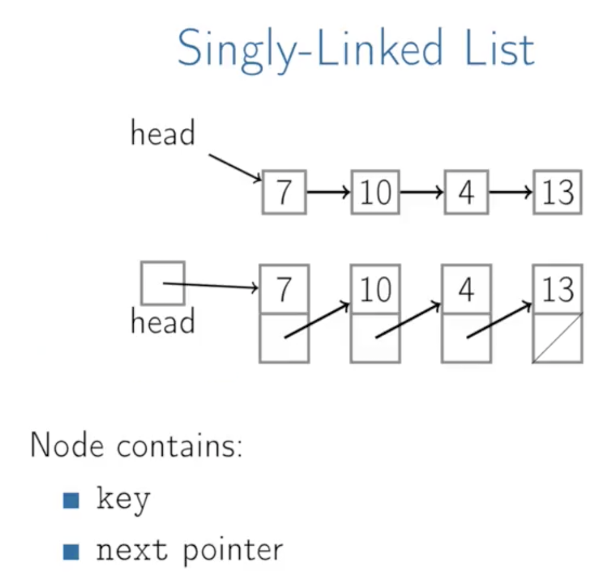

# Introduction

## Summary

Linked lists, it's named kind of like links in a chain, right, so we've got a head pointer that points to a node that then has some data and points to another node, points to another node and eventually points to one that doesn't point any farther.



A linked list is a collection of nodes that are connected by links. Linked list contains node which store the data items and the address to the next node. The first node is usually referred to as the head node and the last node is referred to as the tail node. The pointer of the head node points to the next node and the pointer of the tail node points to Null.


The dynamics of this data structure makes it easier to add or remove nodes from the end. In order to add/remove a node, you just need to keep track of the previous node and the node after and adjust the pointers accordingly.

## Definition

In computer science, a linked list is a linear collection of data elements, whose order is not given by their physical placement in memory. Instead, each element points to the next. It is a data structure consisting of a collection of nodes which together represent a sequence. In its most basic form, each node contains: data, and a reference (in other words, a link) to the next node in the sequence. This structure allows for efficient insertion or removal of elements from any position in the sequence during iteration. More complex variants add additional links, allowing more efficient insertion or removal of nodes at arbitrary positions. A drawback of linked lists is that access time is linear (and difficult to pipeline). Faster access, such as random access, is not feasible. Arrays have better cache locality compared to linked lists.

Linked lists are among the simplest and most common data structures. They can be used to implement several other common abstract data types, including lists, stacks, queues, associative arrays, and S-expressions, though it is not uncommon to implement those data structures directly without using a linked list as the basis.


The principal benefit of a linked list over a conventional array is that the list elements can be easily inserted or removed without reallocation or reorganization of the entire structure because the data items need not be stored contiguously in memory or on disk, while restructuring an array at run-time is a much more expensive operation. Linked lists allow insertion and removal of nodes at any point in the list, and allow doing so with a constant number of operations by keeping the link previous to the link being added or removed in memory during list traversal.

On the other hand, since simple linked lists by themselves do not allow random access to the data or any form of efficient indexing, many basic operations—such as obtaining the last node of the list, finding a node that contains a given datum, or locating the place where a new node should be inserted—may require iterating through most or all of the list elements. The advantages and disadvantages of using linked lists are given below.

## Disadvantages

They use more memory than arrays because of the storage used by their pointers.

Nodes in a linked list must be read in order from the beginning as linked lists are inherently sequential access.

Nodes are stored incontiguously, greatly increasing the time periods required to access individual elements within the list, especially with a CPU cache.

Difficulties arise in linked lists when it comes to reverse traversing. For instance, singly linked lists are cumbersome to navigate backwards[1] and while doubly linked lists are somewhat easier to read, memory is consumed in allocating space for a back-pointer.

## Singly linked list

Each record of a linked list is often called an 'element' or 'node'.

The field of each node that contains the address of the next node is usually called the 'next link' or 'next pointer'. The remaining fields are known as the 'data', 'information', 'value', 'cargo', or 'payload' fields.

The 'head' of a list is its first node. The 'tail' of a list may refer either to the rest of the list after the head, or to the last node in the list. In Lisp and some derived languages, the next node may be called the 'cdr' (pronounced could-er) of the list, while the payload of the head node may be called the 'car'.

Singly linked lists contain nodes which have a data field as well as 'next' field, which points to the next node in line of nodes. Operations that can be performed on singly linked lists include insertion, deletion and traversal.


*A singly linked list whose nodes contain two fields: an integer value and a link to the next node*

### Operations


#### PushFront

1 - Create a node <br>
2 - Update our next pointer of that node to point to the head <br>
3 - Update the head pointer to point to our new node <br>
Allocate, update one pointer, update another pointer, constant time. It's O(1). <br>


| PushFront(key)                             |
|-----------------------------------------|
| `node <- new node`                 |
| `node.key <- key` |
| `node.next <- head`                          |
| `head <- node`                          |
| `if tail = nil:`                          |
| &nbsp;&nbsp;`tail <- head`                          |

#### TopFront

1 - Look at the first element and return it. <br>
So TopFront is O(1).<br>

#### PopFront

1 - Update the head pointer <br>
2 - Remove the node. <br>
So PopFront is going to be O(1).<br>

| PopFront()                             |
|-----------------------------------------|
| `if head = nil:`                 |
| &nbsp;&nbsp;`ERROR: empty list` |
| `head <- head.next`                          |
| `if head = nil:`                          |
| &nbsp;&nbsp;`tail <- nil`                          |

<br />

#### PushBack

If we want to push at the back, and we don't have a tail pointer, then it's going to be a fairly expensive operation. <br>
1 - Start at the head and walk our way down the list until we get to the end <br>
2 - Add a node there. <br>
So that's going to be O(n) time. <br>

| PushBack(key)                             |
|-----------------------------------------|
| `node <- new node`                 |
| `node.key <- key` |
| `node.next <- nil`                          |
| `head <- node`                          |
| `if tail = nil:`                          |
| &nbsp;&nbsp;`head <- tail <- node`                          |
| `else:`                          |
| &nbsp;&nbsp;`tail.next <- node`                          |
| &nbsp;&nbsp;`tail <- node`                          |

#### TopBack

1 - Start at the head and walk our way down the list until we get to the end <br>
2 - Return node. <br>
That's going to be O(n) time. <br>

#### PopBack

1 - Start at the head and walk our way down the list until we get to the end minus one <br>
2 - Update the current node pointer to null <br>
3 - Remove the last node <br>
That's going to be O(n) time. <br>

If we have an head pointer and a tail pointer, getting the first element is cheap and getting the last element is cheap.

But PopBack is still O(n) because tail pointer does not point to the previous node, only the last one, in a singy linked list.

| PopFront()                             |
|-----------------------------------------|
| `if head = nil:`                 |
| &nbsp;&nbsp;`ERROR: empty list` |
| `if head = tail:`                          |
| &nbsp;&nbsp;`head <- tail <- nil`                          |
| `else:`                          |
| &nbsp;&nbsp;`p <- head`                          |
| &nbsp;&nbsp;`while p.next.next != nil:`                          |
| &nbsp;&nbsp;&nbsp;&nbsp;`p <- p.next`                          |
| &nbsp;&nbsp;`p.next <- nil;` |
| &nbsp;&nbsp;`tail <- p;` |

#### Add After

| AddAfter(node, key) |
|---------------------|
| `node2 <- new node` |
| `node2.key <- key` |
| `node2.next = node.next` |
| `node.next =  node2` |
| `if tail = node:` |
| &nbsp;&nbsp;`tail <- node2` |

## Doubly-Linked List

A doubly linked list is not much different from a singly linked list, the only thing that sets them apart is the pointer to the previous node. The picture below can give you a brief idea of what the structure should look like.


In the case of a doubly linked list, the previous pointer of the head node points to Null and the next pointer of the tail points to Null. The previous pointer makes it easier to traverse in either direction. So, node addition and removal become super easy, all you need to do is keep track of the previous node and the next node and adjust the pointer accordingly.

Bi-directional pointers, to the next node and previous node.

The Linked-List contains a key, next pointer a previous pointer to go forward or go backwards.


*A doubly linked list whose nodes contain three fields: an integer value, the link forward to the next node, and the link backward to the previous node*

PopBack is now order 1, constant-time.

A technique known as XOR-linking allows a doubly linked list to be implemented using a single link field in each node. However, this technique requires the ability to do bit operations on addresses, and therefore may not be available in some high-level languages.

Many modern operating systems use doubly linked lists to maintain references to active processes, threads, and other dynamic objects. A common strategy for rootkits to evade detection is to unlink themselves from these lists.

### Operations

#### PushBack(key)

```
node <- new node
node.key <- key
node.next <- nil
if tail = nil
    head <- tail <- node
    node.prev = nil
else:
    tail.next = node
    node.prev = tail
    tail = node
```

#### PopBack()

```
if head = nil:
    ERROR: emtpy list
if head = tail:
    head <- tail <- nil
else:
    tail <- tail.prev
    tail.next <- nil
```

#### AddAfter(node, key)

```
node2 <- new node
node2.key <- key
node2.next <- node
node2.prev <- node.prev
node.prev <- node2
if node2.prev != nil:
    node2.prev.next <- node2
if head = node:
    head <- node2
```

## Multiply linked list

In a 'multiply linked list', each node contains two or more link fields, each field being used to connect the same set of data records in a different order of same set(e.g., by name, by department, by date of birth, etc.). While doubly linked lists can be seen as special cases of multiply linked list, the fact that the two and more orders are opposite to each other leads to simpler and more efficient algorithms, so they are usually treated as a separate case.

## Circular linked list

In the last node of a list, the link field often contains a null reference, a special value used to indicate the lack of further nodes. A less common convention is to make it point to the first node of the list; in that case the list is said to be 'circular' or 'circularly linked'; otherwise it is said to be 'open' or 'linear'. It is a list where the last pointer points to the first node.


*A circular linked list*

In the case of a circular doubly linked list, the first node also points to the last node of the list.

### Operations Time


## Order of common operations


# Resources:

[Coursera](https://www.coursera.org)

[Introduction to data structures](https://medium.com/swlh/introduction-to-data-structures-9134b7d064a6)