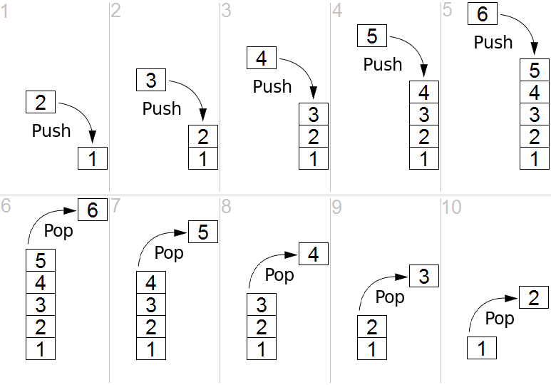

# Stack

## Summary

The stack data structure is precisely what it sounds like: a stack of data. In certain types of problems, it can be favorable to store data in a stack rather than in an array.
A stack uses LIFO (last-in first-out) ordering. That is, as in a stack of dinner plates, the most recent item added to the stack is the  rst item to be removed.

It uses the following operations:

Unlike an array, a stack does not offer constant-time access to the ith item. However, it does allow constant­ time adds and removes, as it doesn't require shifting elements around.
Abstract data type with the following operations:

* Push(key): adds key to collection

* Peek(): returns most recently-added key

* Pop(): removes and returns most recently-added key

* isEmpty(): Return true if and only if the stack is empty.

One case where stacks are often useful is in certain recursive algorithms. Sometimes you need to push temporary data onto a stack as you recurse, but then remove them as you backtrack (for example, because the recursive check failed). A stack offers an intuitive way to do this.

## Definition

A stack can also be used to implement a recursive algorithm iteratively.

In computer science, a stack is an abstract data type that serves as a collection of elements, with two principal operations:

- **push**, which adds an element to the collection, and
- **pop**, which removes the most recently added element that was not yet removed.

The order in which elements come off a stack gives rise to its alternative name, LIFO (last in, first out). Additionally, a peek operation may give access to the top without modifying the stack.[1] The name "stack" for this type of structure comes from the analogy to a set of physical items stacked on top of each other, which makes it easy to take an item off the top of the stack, while getting to an item deeper in the stack may require taking off multiple other items first.

Considered as a linear data structure, or more abstractly a sequential collection, the push and pop operations occur only at one end of the structure, referred to as the top of the stack. This makes it possible to implement a stack as a singly linked list and a pointer to the top element. A stack may be implemented to have a bounded capacity. If the stack is full and does not contain enough space to accept an entity to be pushed, the stack is then considered to be in an overflow state. The pop operation removes an item from the top of the stack.

## Applications of stacks

### Forward/Backward

Redo-undo features at many places like editors, photoshop. Forward and backward feature in web browsers.

### Expression evaluation and syntax parsing

Calculators employing reverse Polish notation use a stack structure to hold values. Expressions can be represented in prefix, postfix or infix notations and conversion from one form to another may be accomplished using a stack. Many compilers use a stack for parsing the syntax of expressions, program blocks etc. before translating into low level code. Most programming languages are context-free languages, allowing them to be parsed with stack based machines.

### Backtracking

Another important application of stacks is backtracking. Consider a simple example of finding the correct path in a maze. There are a series of points, from the starting point to the destination. We start from one point. To reach the final destination, there are several paths. Suppose we choose a random path. After following a certain path, we realise that the path we have chosen is wrong. So we need to find a way by which we can return to the beginning of that path. This can be done with the use of stacks. With the help of stacks, we remember the point where we have reached. This is done by pushing that point into the stack. In case we end up on the wrong path, we can pop the last point from the stack and thus return to the last point and continue our quest to find the right path. This is called backtracking.

The prototypical example of a backtracking algorithm is depth-first search, which finds all vertices of a graph that can be reached from a specified starting vertex. Other applications of backtracking involve searching through spaces that represent potential solutions to an optimization problem. Branch and bound is a technique for performing such backtracking searches without exhaustively searching all of the potential solutions in such a space.

### Compile time memory management

A number of programming languages are stack-oriented, meaning they define most basic operations (adding two numbers, printing a character) as taking their arguments from the stack, and placing any return values back on the stack. For example, PostScript has a return stack and an operand stack, and also has a graphics state stack and a dictionary stack. Many virtual machines are also stack-oriented, including the p-code machine and the Java Virtual Machine.

Almost all calling conventions‍—‌the ways in which subroutines receive their parameters and return results‍—‌use a special stack (the "call stack") to hold information about procedure/function calling and nesting in order to switch to the context of the called function and restore to the caller function when the calling finishes. The functions follow a runtime protocol between caller and callee to save arguments and return value on the stack. Stacks are an important way of supporting nested or recursive function calls. This type of stack is used implicitly by the compiler to support CALL and RETURN statements (or their equivalents) and is not manipulated directly by the programmer.

Some programming languages use the stack to store data that is local to a procedure. Space for local data items is allocated from the stack when the procedure is entered, and is deallocated when the procedure exits. The C programming language is typically implemented in this way. Using the same stack for both data and procedure calls has important security implications (see below) of which a programmer must be aware in order to avoid introducing serious security bugs into a program.

### Efficient algorithms

Several algorithms use a stack (separate from the usual function call stack of most programming languages) as the principle data structure with which they organize their information. These include:

Graham scan, an algorithm for the convex hull of a two-dimensional system of points. A convex hull of a subset of the input is maintained in a stack, which is used to find and remove concavities in the boundary when a new point is added to the hull.

Part of the SMAWK algorithm for finding the row minima of a monotone matrix uses stacks in a similar way to Graham scan.

All nearest smaller values, the problem of finding, for each number in an array, the closest preceding number that is smaller than it. One algorithm for this problem uses a stack to maintain a collection of candidates for the nearest smaller value. For each position in the array, the stack is popped until a smaller value is found on its top, and then the value in the new position is pushed onto the stack.[12]
The nearest-neighbor chain algorithm, a method for agglomerative hierarchical clustering based on maintaining a stack of clusters, each of which is the nearest neighbor of its predecessor on the stack. When this method finds a pair of clusters that are mutual nearest neighbors, they are popped and merged.

## Security

Some computing environments use stacks in ways that may make them vulnerable to security breaches and attacks. Programmers working in such environments must take special care to avoid the pitfalls of these implementations.

For example, some programming languages use a common stack to store both data local to a called procedure and the linking information that allows the procedure to return to its caller. This means that the program moves data into and out of the same stack that contains critical return addresses for the procedure calls. If data is moved to the wrong location on the stack, or an oversized data item is moved to a stack location that is not large enough to contain it, return information for procedure calls may be corrupted, causing the program to fail.

Malicious parties may attempt a stack smashing attack that takes advantage of this type of implementation by providing oversized data input to a program that does not check the length of input. Such a program may copy the data in its entirety to a location on the stack, and in so doing it may change the return addresses for procedures that have called it. An attacker can experiment to find a specific type of data that can be provided to such a program such that the return address of the current procedure is reset to point to an area within the stack itself (and within the data provided by the attacker), which in turn contains instructions that carry out unauthorized operations.

This type of attack is a variation on the buffer overflow attack and is an extremely frequent source of security breaches in software, mainly because some of the most popular compilers use a shared stack for both data and procedure calls, and do not verify the length of data items. Frequently programmers do not write code to verify the size of data items, either, and when an oversized or undersized data item is copied to the stack, a security breach may occur.

## Support for Stacks for different programming languages:

Java :- Java has an inbuilt class called Stack which can be used to implement stack data structures.

C++ :- Like Java, C++ has also a Standard Template Library called stack for linked list implementation.

Python :- Python does not have an explicit stack class, but lists can be implemented as stacks.

## Implementation

There are two ways to implement a stack:

- Using array
- Using linked list

### Using Array

Pros: Easy to implement. Memory is saved as pointers are not involved.

Cons: It is not dynamic. It doesn’t grow and shrink depending on needs at runtime.

[stack-array](https://github.com/tiagoinacio/algorithms_cpp/blob/master/src/data-structures/stack/stack-array.h)

[Stack array with min function to keep track of minimum element on the stack](https://github.com/tiagoinacio/algorithms_cpp/blob/master/src/data-structures/stack/stack-array-min.h)

[fixed multi-stack](https://github.com/tiagoinacio/algorithms_cpp/blob/master/src/data-structures/stack/fixed-multi-stack.h)

[Dynamic multi-stack](https://github.com/tiagoinacio/algorithms_cpp/blob/master/src/data-structures/stack/dynamic-multi-stack.h)

### Using Linked List

Pros: The linked list implementation of stack can grow and shrink according to the needs at runtime.

Cons: Requires extra memory due to involvement of pointers.

[stack-list](https://github.com/tiagoinacio/algorithms_cpp/blob/master/src/data-structures/stack/stack-list.h)

## Exercices

## Sort stack (cracking the code interview)

[c++](https://github.com/tiagoinacio/algorithms_cpp/blob/master/src/utils/stack/sort-stack.h)

## Resources:

[Geeksforgeeks](https://www.geeksforgeeks.org/stack-data-structure-introduction-program/)

[Wikipedia](https://en.wikipedia.org/wiki/Stack_%28abstract_data_type%29#Problem_Description)

[Coursera](https://www.coursera.org)

[Introduction to data structures](https://medium.com/swlh/introduction-to-data-structures-9134b7d064a6)