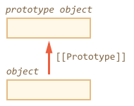
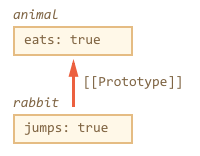
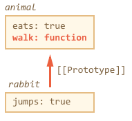
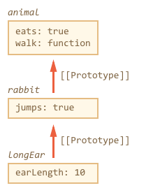

# Javascript and Inheritance

Unlike most other languages, JavaScript’s object system is based on prototypes, not classes.
Inheritance is fundamentally a code reuse mechanism: A way for different kinds of objects to share code.

# Prototype

In JavaScript, objects have a special hidden property [[Prototype]] (as named in the specification), that is either null or references another object. That object is called “a prototype”:



That [[Prototype]] has a “magical” meaning. When we want to read a property from object, and it’s missing, JavaScript automatically takes it from the prototype.

The property [[Prototype]] is internal and hidden, but there are many ways to set it.

One of them is to use __proto__, like this:

```
let animal = {
  eats: true
};
let rabbit = {
  jumps: true
};

rabbit.__proto__ = animal;
```

Please note that __proto__ is not the same as [[Prototype]]. That’s a getter/setter for it. We’ll talk about other ways of setting it later, but for now __proto__ will do just fine.

If we look for a property in rabbit, and it’s missing, JavaScript automatically takes it from animal.

```
let animal = {
  eats: true
};
let rabbit = {
  jumps: true
};

rabbit.__proto__ = animal; // rabbit inherits from animal

// we can find both properties in rabbit now:
alert( rabbit.eats ); // true - altough rabbit does not have a property called eats, animal (its prototype) has it
alert( rabbit.jumps ); // true
```

Here we can say that "animal is the prototype of rabbit" or "rabbit prototypally inherits from animal".



Here we can say that "animal is the prototype of rabbit" or "rabbit prototypally inherits from animal".

So if animal has a lot of useful properties and methods, then they become automatically available in rabbit. Such properties are called “inherited”.

If we have a method in animal, it can be called on rabbit:

```
let animal = {
  eats: true,
  walk() {
    alert("Animal walk");
  }
};

let rabbit = {
  jumps: true,
  __proto__: animal
};

// walk is taken from the prototype
rabbit.walk(); // Animal walk
```

The method is automatically taken from the prototype, like this:



The prototype chain can be longer:

```
let animal = {
  eats: true,
  walk() {
    alert("Animal walk");
  }
};

let rabbit = {
  jumps: true,
  __proto__: animal
};

let longEar = {
  earLength: 10,
  __proto__: rabbit
}

// walk is taken from the prototype chain
longEar.walk(); // Animal walk
alert(longEar.jumps); // true (from rabbit)
```



There are actually only two limitations:

1 - The references can’t go in circles. JavaScript will throw an error if we try to assign __proto__ in a circle.

2 - The value of __proto__ can be either an object or null. All other values (like primitives) are ignored.

Also it may be obvious, but still: there can be only one [[Prototype]]. An object may not inherit from two others.

## Object.prototype

The Object.prototype property represents the Object prototype object.

### Object.prototype.constructor

All objects (with the exception of objects created with Object.create(null)) will have a constructor property.  Objects created without the explicit use of a constructor function (i.e. the object and array literals) will have a constructor property that points to the Fundamental Object constructor type for that object.

```
var o = {};
o.constructor === Object; // true

var o = new Object;
o.constructor === Object; // true

var a = [];
a.constructor === Array; // true

var a = new Array;
a.constructor === Array; // true

var n = new Number(3);
n.constructor === Number; // true
```

We often use constructor functions:

```
function Car(name) {
  this.name = name
}

const fiat = new Car('fiat');

fiat.start = function () {
  console.log(this.name);
};

fiat.start(); // 'fiat'

Car.prototype.start = function () {
  console.log(`${this.name} on prototype`);
};

const bmw = new Car('bmw');

bmw.start(); // 'bmw on prototype'

const audi = Object.create(Car, {
  name: {
    enumerable: true,
    value: 'audi'
  }
});

audi.start(); // 'audi on prototype'
```

Assigning methods to the prototype saves memory consuption because we only have 1 method in memory, instead of having `n` methods replicated by the number of instances. On this case we have `start` function on the fiat object, and `start` function on the Car's prototype.

## Object.create

The Object.create() method creates a new object, using an existing object to provide the newly created object's __proto__ .

```
const person = {
  isHuman: false,
  printIntroduction: function () {
    console.log(`My name is ${this.name}. Am I human? ${this.isHuman}`);
  }
};

const me = Object.create(person);

me.name = "Matthew"; // "name" is a property set on "me", but not on "person"
me.isHuman = true; // inherited properties can be overwritten

me.printIntroduction();
// expected output: "My name is Matthew. Am I human? true"
```

# Class inheritance vs Prototypal inheritance in Javascript

Class Inheritance: A class is like a blueprint — a description of the object to be created. Classes inherit from classes and create subclass relationships: hierarchical class taxonomies.

Constructor functions are used to create new instances. The ES6 `class` keyword desugars to a constructor function:

```
class Foo {}
typeof Foo // 'function'
```

Prototypal Inheritance: A prototype is a working object instance. Objects inherit directly from other objects.

Instances may be composed from many different source objects, allowing for easy selective inheritance and a flat [[Prototype]] delegation hierarchy.

Instances are typically instantiated via factory functions, object literals, or `Object.create()`.


### Resources:

[classes vs prototypes](https://medium.com/javascript-scene/master-the-javascript-interview-what-s-the-difference-between-class-prototypal-inheritance-e4cd0a7562e9)

[prototypal inheritance](https://javascript.info/prototype-inheritance)

[Object.prototype.constructor](https://developer.mozilla.org/en-US/docs/Web/JavaScript/Reference/Global_Objects/Object/constructor)